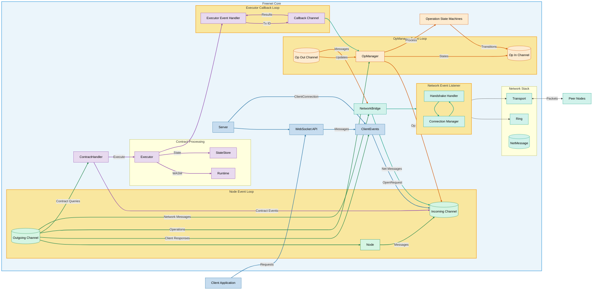

# Freenet Core Crate Architecture

**Key Components & Communication:**

- **[Server](src/server/mod.rs):** Handles HTTP and WebSocket endpoints for client connections. The `ClientConnection` enum in [http_gateway.rs](src/server/http_gateway.rs) defines the interface between the server and client events system. The server manages the WebSocket API and passes client requests to the ClientEvents subsystem.

- **[Node](src/node.rs):** Central coordinator with the main event loop implemented in `run_event_loop()`. This function contains the core `tokio::select!` loop that dispatches events to appropriate handlers like `handle_network_message()`, `handle_node_event()`, and `handle_client_request()`. 

- **[ClientEvents](src/client_events/mod.rs):** Bridges client connections to the Node system through the `ClientEventsProxy` trait in [mod.rs](src/client_events/mod.rs). The WebSocket implementation in [websocket.rs](src/client_events/websocket.rs) provides key methods like `websocket_interface()` and `process_client_request()` that handle client connections.

- **[OpManager](src/operations/op_manager.rs):** Tracks operation state using internal hash maps for each operation type. The `push()` and `pop()` methods manage operation lifecycle, while `garbage_cleanup_task()` runs as a background task to remove stale transactions. Other important methods include `notify_op_change()` and `notify_node_event()` for event notification.

- **[ContractHandler](src/contract/handler.rs):** Manages contract interactions through `ContractHandlerChannel<T>` with different halves for different communication directions. The `send_to_handler()` and `recv_from_sender()` methods implement the bidirectional communication protocol for contract operations.

- **[ContractExecutor](src/contract/executor.rs):** Executes WASM contract code with network capabilities defined by the `ContractExecutor` trait. The `Executor<R>` implementation connects contracts to the network using `ComposeNetworkMessage<Op>` implementations like `GetContract`, `PutContract`, and `UpdateContract`.

- **[WasmRuntime](src/wasm_runtime/mod.rs):** Provides the sandboxed execution environment through the `ContractRuntimeInterface` and `DelegateRuntimeInterface` traits defined in [mod.rs](src/wasm_runtime/mod.rs). These traits include methods for contract instantiation and function invocation.

- **[StateStore](src/contract/storages.rs):** Handles persistent contract state through the `StateStore<S>` implementation, which provides methods like `get_state()` and `put_state()`. The backing store is abstracted through the `Storage` trait.

- **[NetworkBridge](src/node/network_bridge/mod.rs):** Abstracts network communication via the `NetworkBridge` trait in [network_bridge.rs](src/node/network_bridge.rs). The primary implementation is `P2pConnManager` in [p2p_protoc.rs](src/node/network_bridge/p2p_protoc.rs), which provides the `run_event_listener()` method containing the network event loop.

- **[Ring](src/ring/mod.rs):** Manages network topology through the `Ring` struct and `ConnectionManager` in [mod.rs](src/ring/mod.rs). Key methods include `add_connection()` for peer registration and `route()` for determining message paths.

- **[Transport](src/transport/mod.rs):** Implements low-level communication through the `Socket` trait in [mod.rs](src/transport/mod.rs). The `UdpSocket` implementation provides the actual network I/O operations with support for encryption and rate limiting.

- **[NetMessage](src/message.rs):** Defines the message format used for P2P communication through the `NetMessage` enum hierarchy. Each message includes a `Transaction` ID for tracking and contains operation-specific data in variants like `ConnectMsg`, `PutMsg`, and `GetMsg`.

- **[Operation State Machines](src/operations/mod.rs):** Each operation type is implemented in a dedicated module (e.g., [get.rs](src/operations/get.rs), [put.rs](src/operations/put.rs)) with functions like `start_op()` to create initial state and `request_get()` to initiate network operations.

**Event Loops and Channels:**

1. **Node Event Loop:** The primary coordination loop in [node.rs:run_event_loop()](src/node.rs). Channels are created with `event_loop_notification_channel()` in [network_bridge.rs](src/node/network_bridge.rs), which sets up the `EventLoopNotificationsReceiver` and `EventLoopNotificationsSender` for inter-component communication.

2. **OpManager Event Loop:** Implemented as `garbage_cleanup_task()` in [op_manager.rs](src/operations/op_manager.rs). This task continuously monitors for expired transactions and removes them from the system, sending `NodeEvent::TransactionTimedOut` notifications when needed.

3. **Network Event Listener:** The network main loop in [p2p_protoc.rs:run_event_listener()](src/node/network_bridge/p2p_protoc.rs). It uses `wait_for_event()` to multiplex between multiple event sources and routes incoming/outgoing messages appropriately.

4. **Executor Callback Loop:** Created through `executor_channel()` in [executor.rs](src/contract/executor.rs). This allows contract code to initiate network operations and receive results asynchronously while maintaining execution context.

**Request Lifecycle: Client to Network and Back**

A typical client request follows this path through the system:

1. **Client Initiation**
   - Client connects to the WebSocket endpoint at `/v1/contract/command`
   - `websocket_commands()` in `client_events/websocket.rs` handles the connection
   - Client sends a `ClientRequest` (e.g., `ContractRequest::Get{key}`)

2. **Request Processing**
   - `process_client_request()` deserializes the request and assigns a `ClientId`
   - `WebSocketProxy.recv()` wraps it in an `OpenRequest` and sends to the Node
   - Node receives the request in `handle_client_request()` and determines the type

3. **Operation Creation**
   - For GET requests: Node calls `get::start_op()` to create a new `GetOp`
   - `OpManager.push()` stores the operation state in its collections
   - Node initiates the operation with `get::request_get()`
   - A unique `Transaction` ID is assigned to track this operation

4. **Network Traversal**
   - `OpManager` determines the target peer based on the contract key's location
   - It constructs a `NetMessage::V1(NetMessageV1::Get(GetMsg::...))`
   - `NetworkBridge.send()` delivers this to the target peer
   - `P2pConnManager` sends the actual network packet via `UdpSocket.send_to()`

5. **Remote Processing**
   - The receiving peer's `NetworkBridge` gets the message via `UdpSocket.recv_from()`
   - `P2pConnManager.process_message()` forwards to Node's event loop
   - Remote Node processes the Get request in its contract subsystem
   - If the contract exists, a response message is created and sent back

6. **Response Handling**
   - Local `NetworkBridge` receives the response message
   - Node event loop processes it in `handle_network_message()`
   - Message is matched to pending `Transaction` via its ID
   - `OpManager.pop()` retrieves and updates the operation state
   - Contract state from response is stored in `StateStore` if needed

7. **Client Response**
   - Node creates a `HostResponse::ContractResponse(ContractResponse::GetResponse{...})`
   - Response is sent to `WebSocketProxy.send(client_id, result)`
   - `process_host_response()` serializes it in client's preferred format (Flatbuffers/Native)
   - WebSocket connection sends serialized response to client application

This cycle demonstrates how a distributed operation flows through all major components while maintaining transaction context throughout the process. Each step includes error handling and timeout mechanisms to ensure reliability.

_Refer to the diagram above for a visual representation of these interactions._
