# Enhanced Test Event Reporting

## Overview

When tests fail (or succeed with `aggregate_events = "always"`), Freenet now automatically generates comprehensive diagnostic reports in addition to the console summary.

## What You Get

### 1. Detailed Event Log (Markdown)
**Location**: `/tmp/freenet-test-{test-name}-{timestamp}/events.md`

A complete markdown document with:
- Full event details (no truncation!)
- Chronological ordering
- Elapsed time from test start
- Complete Debug output for each event
- Peer ID and transaction ID for each event

**Example**:
```markdown
## Events by Timestamp

### 🔗 Connect - [     0ms]

- **Peer ID**: `v6MWKgqKXYZ...`
- **Transaction**: `Transaction(abc123...)`
- **Timestamp**: 2025-10-30T17:30:45.123Z

**Event Details**:
\`\`\`rust
Connect(Connected {
    gateway: PeerInfo {
        peer_id: PeerId(...),
        location: 0.5,
        ...
    },
    ...
})
\`\`\`
```

### 2. Mermaid Flow Diagram
**Location**: `/tmp/freenet-test-{test-name}-{timestamp}/event-flow.mmd`

A visual flowchart showing event sequence:
- Shows up to 50 events (indicates if more exist)
- Each node shows: peer ID (first 8 chars), emoji icon, event type
- Arrows show chronological flow

**Example**:


```mermaid
graph TD
    N0["v6MWKgqK 🔗 Connect"]
    N1["v6MWKgqJ 🔗 Connect"]
    N2["v6MWKgqK 📤 Put"]
    N3["v6MWKgqJ 🔀 Route"]
    N0 --> N1
    N1 --> N2
    N2 --> N3
```

### 3. Console Links
The console output includes clickable links to both files:

```
📁 Detailed Reports Generated:
  📄 Full event log:     file:///tmp/freenet-test-test_failure-20251030-173045/events.md
  📊 Event flow diagram: file:///tmp/freenet-test-test_failure-20251030-173045/event-flow.mmd

💡 Tip: View diagram at https://mermaid.live or in VS Code
```

## How to Use

### Viewing the Reports

#### Option 1: Click Links in Terminal
Most modern terminals (iTerm2, VS Code terminal, Windows Terminal) support `file://` links:
1. Cmd+Click (Mac) or Ctrl+Click (Windows/Linux) on the link
2. File opens in your default application

#### Option 2: Manual Navigation
```bash
# Navigate to the temp directory
cd /tmp/freenet-test-test_failure-20251030-173045

# View event log
cat events.md
# or open in editor
code events.md
```

#### Option 3: View Mermaid Diagram
Three ways to view the diagram:

1. **VS Code**: Install "Markdown Preview Mermaid Support" extension, then open `event-flow.mmd`
2. **GitHub**: Upload the `.mmd` file to a gist - GitHub renders Mermaid automatically
3. **Mermaid Live Editor**:
   ```bash
   # Copy content
   cat event-flow.mmd | pbcopy  # Mac
   cat event-flow.mmd | xclip    # Linux

   # Paste at https://mermaid.live
   ```

### Finding Old Reports
```bash
# List all test reports
ls -lt /tmp/freenet-test-* | head -20

# Find reports from today
find /tmp -name "freenet-test-*" -mtime -1

# Search for specific test
ls -d /tmp/freenet-test-test_put_contract-*
```

## Use Cases

### Debugging PUT Timeouts

**Problem**: Test times out waiting for PUT response

**With Enhanced Reporting**:
1. Check console for file links
2. Open `events.md` for full details
3. Search for "Put(Request" to find when PUT was sent
4. Check if any "Put(Success" or "Put(Error" events followed
5. Look at routing events to see where request went
6. View `event-flow.mmd` to visualize the flow

**Result**: Quickly identify if request was sent, received, or got lost in routing.

### Understanding Multi-Node Interactions

**Problem**: Need to understand how operation propagated through network

**With Enhanced Reporting**:
1. Open `event-flow.mmd` in Mermaid viewer
2. Visual shows which peer did what, in what order
3. Each event node shows peer ID and event type
4. Arrows show sequence flow

**Result**: Instant visual understanding of distributed operation.

### Sharing Context with Team

**Problem**: Need to share test failure context with teammate

**With Enhanced Reporting**:
```bash
# Zip the report directory
cd /tmp
zip -r test-failure-report.zip freenet-test-test_failure-20251030-173045/

# Share via Slack/email/etc.
```

Teammate can:
- Read full event details in markdown
- View diagram to understand flow
- No need to re-run test or parse console output

### Analyzing Event Patterns

**Problem**: Want to analyze event sequences across multiple test runs

**With Enhanced Reporting**:
```bash
# Extract all events from multiple reports
for dir in /tmp/freenet-test-*/; do
    echo "=== $dir ==="
    grep "### " "$dir/events.md" | head -10
done

# Count event types across runs
grep "### " /tmp/freenet-test-*/events.md | cut -d' ' -f2 | sort | uniq -c
```

**Result**: Spot patterns like "Connect events always happen in pairs" or "Route events missing in failing tests"

## Event Icons Reference

| Icon | Event Type | Meaning |
|------|-----------|---------|
| 🔗 | Connect | Peer connection established |
| 📤 | Put | Contract storage operation |
| 📥 | Get | Contract retrieval operation |
| 🔀 | Route | Message routing event |
| 🔄 | Update | Contract state update |
| 🔔 | Subscribe | Subscription established |
| ❌ | Disconnect | Peer disconnected |
| ⏭️ | Ignored | Event was ignored |

## Configuration

### Control When Reports Are Generated

Via macro attribute:
```rust
#[freenet_test(
    nodes = ["gateway", "peer"],
    aggregate_events = "always"  // Generate reports even on success
)]
```

Values:
- `"always"` - Generate reports for all test runs
- `"on_failure"` (default) - Only generate on test failure
- `"never"` - Don't generate reports

### Custom Report Location (Future)

Currently reports go to `/tmp/freenet-test-{name}-{timestamp}`.

Future enhancement:
```bash
# Environment variable to customize location
export FREENET_TEST_REPORT_DIR=/path/to/custom/dir
cargo test
```

### Auto-Open in Browser (Future)

Future enhancement:
```bash
# Auto-open markdown in default viewer
export FREENET_TEST_OPEN_REPORT=1
cargo test
```

## Limitations

### Current Limitations

1. **Mermaid Diagram Size**: Limited to 50 events for readability
   - Shows "... and N more events" if truncated
   - Full details still in `events.md`

2. **Temp Directory**: Files in `/tmp/` may be cleaned by OS
   - Recommendation: Copy important reports to permanent location
   - Future: configurable report directory

3. **Manual Viewing**: No auto-open or HTML rendering yet
   - Must manually open files or click links
   - Future: HTML report with embedded Mermaid rendering

4. **No Transaction Filtering**: Shows all events, not per-transaction
   - Future: Generate separate reports per transaction

### Known Issues

None currently - this is a new feature!

## Comparison: Before vs After

### Before (Console Only)
```
📅 Event Timeline:
  [ 11158ms] v6MWKgqK 📤 Put(Request { contract_key: ContractKey { ...
                                                      ^^^^ TRUNCATED!
```

**Problems**:
- Event details cut off at 60 characters
- No way to see full event content
- Output ephemeral (lost when terminal scrolls)

### After (With Enhanced Reporting)
```
📅 Event Timeline:
  [ 11158ms] v6MWKgqK 📤 Put(Request { contract_key: ContractKey { ...

📁 Detailed Reports Generated:
  📄 Full event log:     file:///tmp/freenet-test-.../events.md
  📊 Event flow diagram: file:///tmp/freenet-test-.../event-flow.mmd
```

**Benefits**:
- Console shows summary (unchanged)
- Full details available in `events.md` (no truncation)
- Visual diagram in `event-flow.mmd`
- Files persist for later analysis

## Future Enhancements

Potential additions (not yet implemented):

1. **JSON Export**: Machine-readable format for CI/CD
   ```json
   {
     "test_name": "test_put_contract",
     "events": [...],
     "statistics": {...}
   }
   ```

2. **HTML Report**: Interactive web page with:
   - Embedded Mermaid diagram (auto-rendered)
   - Filterable event table
   - Search functionality
   - Syntax highlighting

3. **Per-Transaction Reports**: Generate separate report for each transaction
   - Filter events by transaction ID
   - Show routing path for specific transaction
   - Transaction-specific Mermaid diagram

4. **CI/CD Integration**:
   - Upload reports as build artifacts
   - Parse JSON for trending analysis
   - Auto-comment on PRs with report links

5. **Auto-Open**: Automatically open HTML report in browser on failure

## Examples

### Example: Debugging test_put_contract Failure

**Test fails with**: "Timeout waiting for PUT response"

**Steps**:
1. Check console output:
   ```
   📁 Detailed Reports Generated:
     📄 Full event log:     file:///tmp/freenet-test-test_put_contract-20251030-180000/events.md
   ```

2. Open `events.md`:
   ```bash
   code /tmp/freenet-test-test_put_contract-20251030-180000/events.md
   ```

3. Search for "Put" events:
   ```markdown
   ### 📤 Put - [  5123ms]

   **Event Details**:
   \`\`\`rust
   Put(Request {
       contract_key: ContractKey { ... },
       state: WrappedState(...),
       ...
   })
   \`\`\`

   ### 🔀 Route - [  5150ms]

   **Event Details**:
   \`\`\`rust
   Route(RoutingMessage {
       target: PeerId(...),
       ...
   })
   \`\`\`

   # No Put(Success) event found!
   ```

4. **Insight**: PUT request sent, routing occurred, but no success event
   - Suggests operation got stuck in state machine
   - Or response didn't route back to client

5. Open `event-flow.mmd` to visualize:
   ```mermaid
   graph TD
       N0["peer 📤 Put"]
       N1["gateway 🔀 Route"]
       N2["... nothing after"]
       N0 --> N1
       N1 -.-> N2
   ```

6. **Conclusion**: Operation reached gateway but response never came back
   - Check gateway's operation state machine
   - Verify response routing logic

## See Also

- **[TESTING.md](TESTING.md)** - General testing guidelines
- **[EVENT_AGGREGATOR.md](EVENT_AGGREGATOR.md)** - Event aggregation deep dive
- **[freenet-macros README](../crates/freenet-macros/README.md)** - Test macro documentation
- **Issue #1932** - Original debugging challenge that motivated this feature

## Contributing

To enhance this feature:

1. **Add JSON Export**: Implement in `generate_detailed_reports()`
2. **Create HTML Template**: Generate interactive HTML reports
3. **Per-Transaction Filtering**: Use existing `get_transaction_flow()` method
4. **Auto-Open**: Detect OS and use appropriate open command

See `/tmp/enhanced_reporting_design.md` for full design document.

---

**Last Updated**: October 30, 2025
**Feature Status**: ✅ Implemented (Minimal Viable Enhancement)
**Next Steps**: JSON export, HTML reports (future enhancements)
