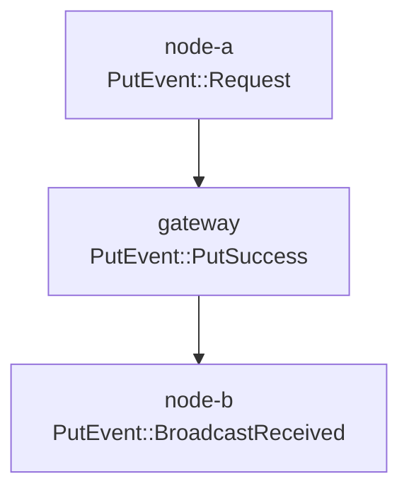

# Event Log Aggregation for Multi-Node Debugging

## Overview

The Event Log Aggregator provides a powerful system for correlating transactions across multiple Freenet nodes. This is particularly useful for:

- **Debugging integration tests** - Trace how operations flow through the network
- **Analyzing production issues** - Reconstruct transaction paths from node logs
- **Understanding network behavior** - Visualize message routing and timing
- **Test assertions** - Verify expected transaction flows

## Architecture

```
┌─────────────────────────────────────────────────────────┐
│                   EventSource Trait                      │
│  (Generic interface for reading events from any source)  │
└─────────────────────────────────────────────────────────┘
                              │
        ┌─────────────────────┼─────────────────────┐
        │                     │                     │
┌───────▼────────┐  ┌────────▼─────────┐  ┌───────▼────────┐
│ AOFEventSource │  │ WebSocketSource  │  │ TestListener   │
│ (Read files)   │  │ (WebSocket srv)  │  │ Source         │
└────────────────┘  └──────────────────┘  └────────────────┘
                              │
                    ┌─────────▼──────────┐
                    │ EventLogAggregator │
                    │  (Correlates &     │
                    │   Analyzes)        │
                    └────────────────────┘
                              │
            ┌─────────────────┼─────────────────┐
            │                 │                 │
    ┌───────▼────────┐ ┌─────▼──────┐ ┌───────▼────────┐
    │ Transaction    │ │  Routing   │ │  Graph Export  │
    │ Flow Query     │ │  Path      │ │  (Mermaid)     │
    └────────────────┘ └────────────┘ └────────────────┘
```

## Usage Modes

### Mode 1: Post-Test AOF Analysis (Recommended for Integration Tests)

After your integration test completes, collect the event log files from each node and aggregate them:

```rust
use freenet::test_utils::TestAggregatorBuilder;
use freenet::tracing::EventLogAggregator;

#[tokio::test]
async fn test_with_event_aggregation() -> TestResult {
    // ... run your test with multiple nodes ...

    // After test completes, aggregate event logs
    let aggregator = TestAggregatorBuilder::new()
        .add_node("gateway", gateway_temp_dir.path().join("_EVENT_LOG_LOCAL"))
        .add_node("node-a", node_a_temp_dir.path().join("_EVENT_LOG_LOCAL"))
        .add_node("node-b", node_b_temp_dir.path().join("_EVENT_LOG_LOCAL"))
        .build()
        .await?;

    // Query transaction flow
    let flow = aggregator.get_transaction_flow(&tx).await?;
    println!("Transaction visited {} nodes", flow.len());

    // Get routing path
    let path = aggregator.get_routing_path(&tx).await?;
    println!("Routing path: {:#?}", path);

    // Export visualization
    let graph = aggregator.export_mermaid_graph(&tx).await?;
    println!("{}", graph);

    Ok(())
}
```

### Mode 2: WebSocket Real-Time Collection (Advanced)

For real-time event collection during test execution:

```rust
use freenet::tracing::EventLogAggregator;

#[tokio::test]
async fn test_with_realtime_aggregation() -> TestResult {
    // Start WebSocket collector BEFORE nodes
    let aggregator = EventLogAggregator::with_websocket_collector(55010).await?;

    // Set environment variable so nodes connect to collector
    std::env::set_var("FDEV_NETWORK_METRICS_SERVER_PORT", "55010");

    // Start nodes (they will automatically connect to collector)
    let node_a = start_node(config_a).await?;
    let node_b = start_node(config_b).await?;

    // Run operations...
    let tx = make_put(&mut client, state, contract).await?;

    // Query aggregator in real-time
    let flow = aggregator.get_transaction_flow(&tx).await?;

    Ok(())
}
```

### Mode 3: Unit Tests with TestEventListener

For fast in-memory unit tests using `SimNetwork`:

```rust
use freenet::dev_tool::SimNetwork;
use freenet::tracing::EventLogAggregator;

#[tokio::test]
async fn unit_test_with_aggregation() -> TestResult {
    let mut net = SimNetwork::new("test", 1, 3, ...).await;
    let handles = net.start().await;

    // Create aggregator from TestEventListener
    let aggregator = EventLogAggregator::from_test_listener(
        Arc::new(net.event_listener.clone())
    );

    // Query immediately (events are in memory)
    let events = aggregator.get_all_events().await?;

    Ok(())
}
```

## API Reference

### `EventLogAggregator`

Main aggregator for collecting and analyzing events across nodes.

#### Methods

- `from_aof_files(paths: Vec<(PathBuf, Option<String>)>)` - Create from AOF log files
- `with_websocket_collector(port: u16)` - Create with WebSocket server
- `from_test_listener(listener: Arc<TestEventListener>)` - Create from in-memory listener
- `get_all_events()` - Get all collected events, sorted by timestamp
- `get_transaction_flow(&Transaction)` - Get all events for a specific transaction
- `get_routing_path(&Transaction)` - Reconstruct the routing path
- `export_mermaid_graph(&Transaction)` - Generate Mermaid visualization
- `clear_cache()` - Clear cached events (re-read from sources)

### `TestAggregatorBuilder`

Convenient builder for integration tests.

#### Methods

- `new()` - Create a new builder
- `add_node(label, path)` - Add a single node's event log
- `add_nodes_from_configs(configs)` - Add multiple nodes from config directories
- `build()` - Build the aggregator

### `TransactionFlowEvent`

Represents a single event in a transaction's journey.

Fields:
- `peer_id: PeerId` - The peer that generated this event
- `peer_label: Option<String>` - Human-readable label (e.g., "node-a")
- `event_kind: EventKind` - The type of event (Connect, Put, Get, etc.)
- `timestamp: DateTime<Utc>` - When the event occurred

### `RoutingPath`

Complete routing path for a transaction.

Fields:
- `transaction: Transaction` - The transaction ID
- `path: Vec<(PeerId, Option<String>)>` - Ordered list of peers traversed
- `duration: Option<Duration>` - Total time from start to end

## Event Log Files

Event logs are stored in append-only files (AOF) at:
- **Network mode**: `<config_dir>/event_log`
- **Local mode**: `<config_dir>/_EVENT_LOG_LOCAL`

These files contain binary-serialized `NetLogMessage` records with:
- Transaction ID
- Timestamp
- Peer ID
- Event kind (Connect, Put, Get, Subscribe, Update, Route, etc.)

## Graph Visualization

The aggregator can export transaction flows as Mermaid diagrams:

```rust
let graph = aggregator.export_mermaid_graph(&tx).await?;
println!("{}", graph);
```

Output example:


## Best Practices

### Integration Tests

1. **Use AOF mode** (Mode 1) for integration tests - it's simpler and more reliable
2. **Keep temp directories** until after aggregation
3. **Add meaningful node labels** for easier debugging
4. **Export graphs** for failed tests to understand what went wrong

```rust
let aggregator = TestAggregatorBuilder::new()
    .add_node("gateway", gw_dir.join("_EVENT_LOG_LOCAL"))
    .add_node("client-a", a_dir.join("_EVENT_LOG_LOCAL"))
    .add_node("client-b", b_dir.join("_EVENT_LOG_LOCAL"))
    .build()
    .await?;

// Always export graph for debugging
let graph = aggregator.export_mermaid_graph(&tx).await?;
eprintln!("{}", graph); // Shows in test output
```

### Production Debugging

For production issues, collect event logs from all relevant nodes:

```bash
# Collect logs from nodes
scp node1:/path/to/.freenet/event_log ./logs/node1_event_log
scp node2:/path/to/.freenet/event_log ./logs/node2_event_log
scp node3:/path/to/.freenet/event_log ./logs/node3_event_log
```

Then analyze locally:

```rust
let aggregator = EventLogAggregator::from_aof_files(vec![
    (PathBuf::from("./logs/node1_event_log"), Some("node1".into())),
    (PathBuf::from("./logs/node2_event_log"), Some("node2".into())),
    (PathBuf::from("./logs/node3_event_log"), Some("node3".into())),
]).await?;

// Find the problematic transaction
let flow = aggregator.get_transaction_flow(&problematic_tx).await?;
```

## Example: Full Integration Test

See `crates/core/tests/test_event_aggregator.rs` for a complete example.

Key points from the example:
1. Start nodes with proper config directories
2. Run operations and capture transaction IDs
3. After test completes, aggregate logs
4. Query transaction flows
5. Export visualizations for debugging

## Limitations

- **WebSocket mode** (Mode 2) requires FlatBuffer parsing implementation (TODO)
- **Memory usage** grows with log size - clear cache if needed
- **AOF files** are append-only and grow over time (rotated at 100K records)
- **Timestamps** depend on system clock synchronization across nodes

## Future Enhancements

- [ ] Implement FlatBuffer parsing for WebSocket mode
- [ ] Add DOT/Graphviz export (in addition to Mermaid)
- [ ] Support filtering events by time range
- [ ] Add performance metrics aggregation
- [ ] Support querying by contract key or peer ID
- [ ] Add automatic graph generation in CI for failed tests

## Related Documentation

- [Testing and Logging Guide](./debugging/testing-logging-guide.md)
- [Event Register Architecture](../crates/core/src/tracing/mod.rs)
- [Integration Tests](../crates/core/tests/)
