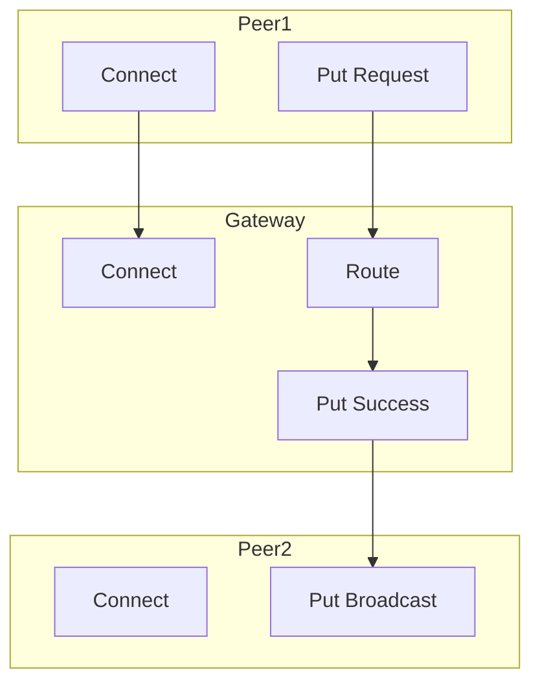

# Test Infrastructure: Future Improvements & Roadmap

**Branch**: feat/event-log-aggregator
**Last Updated**: October 30, 2025
**Status**: Design Doc for Future Work

## Executive Summary

The feat/event-log-aggregator branch has delivered significant improvements to Freenet's test infrastructure:
- `#[freenet_test]` macro reducing 50+ lines of boilerplate to 5
- Enhanced reporting with detailed event logs and Mermaid diagrams
- Automatic event aggregation on test failure
- Comprehensive documentation

This document outlines next steps to build upon this foundation.

## Current State (✅ Completed)

### What We Built

1. **Test Macro Infrastructure**
   - Automatic node setup (gateways + peers)
   - Auto-connect between peers and gateways
   - Event aggregation with flush handles
   - Configurable timeouts, tokio runtime, log levels
   - Multiple gateway support

2. **Enhanced Event Reporting**
   - Console summary with statistics and timeline
   - Detailed markdown reports (no truncation)
   - Mermaid flow diagrams
   - Clickable file:// links to reports
   - Persistent reports in /tmp

3. **Documentation**
   - Comprehensive macro README (550+ lines)
   - Consolidated testing-logging-guide.md (1200+ lines)
   - Branch summary document
   - Event aggregator documentation

### What Works Well

✅ **Dramatically Reduced Boilerplate**: 90% reduction in test code
✅ **Better Debugging**: Full event details + visualizations
✅ **Zero Breaking Changes**: Existing tests unaffected
✅ **Comprehensive Docs**: Well-documented and accessible
✅ **Real Value**: Solves actual pain points (truncation, manual setup)

### Known Issues

❌ **0 Events Problem**: Some tests show 0 events in aggregation
⚠️ **Manual Viewing**: No auto-open or HTML rendering yet
⚠️ **Temp Files**: Reports in /tmp may be cleaned by OS
⚠️ **No Transaction Filtering**: Shows all events, not per-transaction

## Phase 2: High-Priority Improvements

### 1. Fix 0 Events Capture Issue

**Problem**: `test_three_node_network_connectivity` shows "Total events: 0"

**Investigation Plan**:
```rust
// Debug steps:
1. Check if EventRegister is initialized for all nodes
2. Verify event log files are created (_EVENT_LOG)
3. Confirm flush handles are collected properly
4. Add debug logging to event writing code
5. Check if nodes crash before events flush
```

**Possible Causes**:
- Event flushing not working in all scenarios
- Event logging not enabled for certain test types
- Timing issue: nodes terminate before flush completes
- Path mismatch: looking for events in wrong location

**Fix Priority**: **HIGH** - This affects debuggability

**Estimated Effort**: 2-4 hours investigation + fix

### 2. JSON Export for CI/CD

**Value**: Machine-readable event data for automated analysis

**Implementation**:
```rust
// Add to generate_detailed_reports():

let events_json = serde_json::to_string_pretty(&EventsExport {
    test_name: test_name.to_string(),
    timestamp: chrono::Utc::now(),
    total_events: events.len(),
    events: events.iter().map(|e| EventJson {
        timestamp: e.datetime,
        peer_id: e.peer_id.to_string(),
        transaction: e.tx.to_string(),
        event_type: event_type_string(&e.kind),
        details: format!("{:#?}", e.kind),
    }).collect(),
    statistics: EventStatistics {
        by_type: by_type,
        by_peer: by_peer_counts,
        duration_ms: duration.num_milliseconds(),
    },
})?;

std::fs::write(report_dir.join("events.json"), events_json)?;
```

**Use Cases**:
- CI/CD parsing: Upload as build artifact
- Trend analysis: Track event patterns over time
- Automated alerts: Detect anomalies
- Performance tracking: Compare event counts/timing

**Priority**: **MEDIUM** - Valuable for CI/CD but not critical

**Estimated Effort**: 3-4 hours

### 3. HTML Interactive Report

**Value**: Rich, interactive debugging experience

**Features**:
- Embedded Mermaid diagram (auto-rendered)
- Filterable/sortable event table
- Search functionality
- Collapsible event details
- Syntax highlighting
- Copy-to-clipboard buttons

**Implementation**:
```rust
const HTML_TEMPLATE: &str = r#"<!DOCTYPE html>
<html>
<head>
    <title>Test Report: {{test_name}}</title>
    <script src="https://cdn.jsdelivr.net/npm/mermaid/dist/mermaid.min.js"></script>
    <style>
        /* Modern, clean CSS */
        body { font-family: system-ui; max-width: 1200px; margin: 0 auto; }
        .event-table { width: 100%; border-collapse: collapse; }
        .event-row:hover { background: #f5f5f5; }
        .filter-controls { margin: 20px 0; }
        /* ... more styles */
    </style>
</head>
<body>
    <h1>Test Failure Report: {{test_name}}</h1>

    <section id="summary">
        <h2>Summary</h2>
        <div class="error">{{error_message}}</div>
        <div class="stats">{{statistics}}</div>
    </section>

    <section id="diagram">
        <h2>Event Flow Diagram</h2>
        <div class="mermaid">{{mermaid_graph}}</div>
    </section>

    <section id="timeline">
        <h2>Event Timeline</h2>
        <input type="text" id="search" placeholder="Search events...">
        <select id="filter-peer">...</select>
        <select id="filter-type">...</select>
        <table class="event-table" id="events-table">
            {{#each events}}
            <tr class="event-row">
                <td>{{timestamp}}</td>
                <td>{{peer_id}}</td>
                <td>{{event_type}}</td>
                <td><details><summary>Details</summary><pre>{{details}}</pre></details></td>
            </tr>
            {{/each}}
        </table>
    </section>

    <script>
        // Filter/search functionality
        // Mermaid initialization
        // Copy-to-clipboard
    </script>
</body>
</html>
"#;
```

**Priority**: **MEDIUM** - Nice to have, but markdown is sufficient for now

**Estimated Effort**: 8-12 hours (template + JS + styling)

## Phase 3: Advanced Features

### 4. Per-Transaction Filtering

**Value**: Focus on specific transaction flows

**Implementation**:
```rust
#[freenet_test(
    nodes = ["gateway", "peer"],
    track_transactions = true  // NEW FLAG
)]
async fn test_put(ctx: &mut TestContext) -> TestResult {
    let tx_id = perform_put(...).await?;

    // On failure, automatically generates:
    // - /tmp/.../transactions/tx-{id}.md
    // - /tmp/.../transactions/tx-{id}.mmd

    Ok(())
}
```

**Features**:
- Separate report per tracked transaction
- Filter events by transaction ID
- Show routing path for specific transaction
- Transaction-specific Mermaid diagram

**Priority**: **LOW** - Nice enhancement but not critical

**Estimated Effort**: 4-6 hours

### 5. Auto-Open in Browser

**Value**: Immediate visual feedback

**Implementation**:
```rust
// Detect platform and open command
fn open_report_in_browser(path: &Path) -> Result<()> {
    let open_cmd = if cfg!(target_os = "macos") {
        "open"
    } else if cfg!(target_os = "windows") {
        "start"
    } else {
        "xdg-open"
    };

    std::process::Command::new(open_cmd)
        .arg(path)
        .spawn()?;
    Ok(())
}

// In generate_detailed_reports():
if std::env::var("FREENET_TEST_OPEN_REPORT").is_ok() {
    open_report_in_browser(&report_dir.join("report.html"))?;
}
```

**Environment Variable**:
```bash
export FREENET_TEST_OPEN_REPORT=1
cargo test
```

**Priority**: **LOW** - Convenience feature

**Estimated Effort**: 2-3 hours

### 6. Configurable Report Location

**Value**: Avoid /tmp cleanup, organize reports

**Implementation**:
```rust
fn get_report_dir(test_name: &str) -> PathBuf {
    let base_dir = std::env::var("FREENET_TEST_REPORT_DIR")
        .unwrap_or_else(|_| "/tmp".to_string());

    let timestamp = chrono::Utc::now().format("%Y%m%d-%H%M%S");
    PathBuf::from(format!("{}/freenet-test-{}-{}", base_dir, test_name, timestamp))
}
```

**Usage**:
```bash
# Store reports in project directory
export FREENET_TEST_REPORT_DIR=./test-reports
cargo test

# Or in CI, use artifacts directory
export FREENET_TEST_REPORT_DIR=/buildkite/artifacts
cargo test
```

**Priority**: **MEDIUM** - Useful for CI/CD

**Estimated Effort**: 1-2 hours

## Phase 4: Advanced Analysis

### 7. Event Pattern Analysis

**Value**: Detect common patterns across test runs

**Features**:
- Analyze multiple test reports
- Find common event sequences
- Identify deviations from expected patterns
- Generate "expected flow" templates

**Example**:
```bash
# Analyze 10 test runs
freenet-test-analyzer analyze /tmp/freenet-test-test_put-* \
    --find-patterns \
    --output expected-flow.json

# Compare new run against expected
freenet-test-analyzer compare \
    /tmp/freenet-test-test_put-20251030-180000 \
    --against expected-flow.json \
    --highlight-deviations
```

**Priority**: **LOW** - Advanced feature for later

**Estimated Effort**: 16-20 hours (new tool)

### 8. Performance Metrics

**Value**: Track operation timing across tests

**Implementation**:
```rust
struct PerformanceMetrics {
    test_duration_ms: i64,
    first_event_ms: i64,
    last_event_ms: i64,
    event_gaps: Vec<EventGap>,
    slowest_operations: Vec<(String, i64)>,
}

// In reports:
📈 Performance Metrics:
  Test duration: 12.5s
  First event: 0ms
  Last event: 11245ms
  Largest gap: 5000ms (between Put Request and Put Success)

  Slowest operations:
    1. Put operation: 5000ms
    2. Route to peer-2: 150ms
    3. Connect handshake: 50ms
```

**Priority**: **LOW** - Nice to have

**Estimated Effort**: 4-6 hours

## Implementation Priorities

### Immediate (Next Sprint)

1. **Fix 0 Events Issue** (HIGH, 2-4 hours)
   - Critical for debugging
   - Affects usability of all other features

2. **JSON Export** (MEDIUM, 3-4 hours)
   - Enables CI/CD integration
   - Foundation for trend analysis

### Short-Term (1-2 Sprints)

3. **Configurable Report Location** (MEDIUM, 1-2 hours)
   - Simple but valuable
   - Helps CI/CD artifact management

4. **HTML Report** (MEDIUM, 8-12 hours)
   - Significant UX improvement
   - Makes reports more accessible

### Long-Term (Future)

5. **Per-Transaction Filtering** (LOW, 4-6 hours)
6. **Auto-Open Browser** (LOW, 2-3 hours)
7. **Event Pattern Analysis** (LOW, 16-20 hours)
8. **Performance Metrics** (LOW, 4-6 hours)

## Technical Debt & Refactoring

### TestContext API Improvements

**Current**:
```rust
ctx.node("gateway")  // Returns Result<&NodeInfo>
ctx.gateway()        // Returns Result<&NodeInfo>
ctx.peers()          // Returns Vec<&NodeInfo>
```

**Proposed**:
```rust
ctx.nodes()          // Returns &[NodeInfo]
ctx.find_node("...")  // Returns Option<&NodeInfo>
ctx.gateways()       // Returns &[NodeInfo]
ctx.peers()          // Returns &[NodeInfo]

// Builder pattern for queries
ctx.query()
    .node_type(NodeType::Gateway)
    .with_label("gw-1")
    .first()
```

### Event Aggregator Performance

**Current**: Reads all events into memory

**Proposed**: Streaming/lazy evaluation for large event logs
```rust
// Instead of:
let events = aggregator.get_all_events().await?;

// Support:
aggregator
    .events()
    .filter_by_transaction(&tx)
    .filter_by_peer(&peer_id)
    .take(100)
    .collect().await?;
```

### Mermaid Diagram Improvements

**Current**: Simple linear flow, up to 50 events

**Proposed**:
- Group events by peer (swimlanes)
- Show parallel events
- Highlight critical path
- Collapse repetitive sequences



## Success Metrics

### Phase 2 Success

- [ ] 0 events issue resolved (all tests capture events)
- [ ] JSON export available for CI/CD
- [ ] At least 5 failing tests debugged using new reports
- [ ] Documentation updated with new features

### Phase 3 Success

- [ ] HTML reports used by > 50% of developers
- [ ] Configurable report location used in CI
- [ ] Test debugging time reduced by 50% (via survey)

### Phase 4 Success

- [ ] Pattern analysis detects 3+ regressions before they ship
- [ ] Performance metrics identify 5+ slow operations
- [ ] 90% of integration tests use #[freenet_test]

## Risks & Mitigations

### Risk 1: Event Capture Reliability

**Risk**: Events still not captured in some scenarios

**Mitigation**:
- Comprehensive testing of event flushing
- Add debug logging to event capture path
- Document known limitations clearly
- Provide fallback to AOF file reading

### Risk 2: Report Size

**Risk**: Large tests generate huge reports

**Mitigation**:
- Implement event limiting (show first N, last N)
- Add pagination to HTML reports
- Compress old reports automatically
- Provide summary-only mode

### Risk 3: Performance Overhead

**Risk**: Event aggregation slows down tests

**Mitigation**:
- Make aggregation optional (aggregate_events = "never")
- Lazy evaluation where possible
- Profile and optimize hot paths
- Consider async report generation

## Getting Started

### For New Contributors

1. **Pick a task from Phase 2 priorities**
2. **Read existing code**:
   - `crates/core/src/test_utils.rs` (TestContext, reporting)
   - `crates/freenet-macros/src/codegen.rs` (macro implementation)
3. **Create a feature branch**: `feat/test-infra-{feature-name}`
4. **Write tests for your feature**
5. **Update documentation**
6. **Submit PR with examples**

### Example: Implementing JSON Export

```bash
# 1. Create branch
git checkout -b feat/test-infra-json-export

# 2. Add serde dependencies to test_utils
# Edit crates/core/Cargo.toml

# 3. Create JSON export structures
# Add to crates/core/src/test_utils.rs:
#[derive(Serialize)]
struct EventsExport { ... }

# 4. Implement generation
# Update generate_detailed_reports()

# 5. Test it
cargo test --test connectivity test_basic_gateway -- --nocapture
cat /tmp/freenet-test-*/events.json

# 6. Update docs
# Edit docs/debugging/testing-logging-guide.md

# 7. Submit PR
```

## Questions & Discussion

### Open Questions

1. **Should we auto-clean old reports?**
   - Pro: Prevents /tmp bloat
   - Con: Lose historical data
   - Proposed: Env var FREENET_TEST_KEEP_REPORTS with default 7 days

2. **Should we support custom event formatters?**
   - Allow users to provide custom event → string formatting
   - Use case: Hide sensitive data, custom visualizations

3. **Should reports include node logs?**
   - Currently only event logs
   - Could include stdout/stderr from nodes
   - Might be too much information

### Discussion Points for Team

- What's the priority order? (Get team input)
- JSON schema: What fields do we need?
- HTML template: What library/framework?
- Testing strategy: How to test the test infrastructure?

## References

- **Original Issue**: #1932 (uber test debugging)
- **Design Doc**: `/tmp/enhanced_reporting_design.md`
- **Branch Summary**: `docs/BRANCH_SUMMARY_EVENT_LOG_AGGREGATOR.md`
- **Main Documentation**: `docs/debugging/testing-logging-guide.md`
- **Macro Documentation**: `crates/freenet-macros/README.md`

## Changelog

- **2025-10-30**: Initial design doc created
- **TBD**: Phase 2 implementation begins
- **TBD**: Phase 3 features planned

---

**Next Steps**:
1. Review this design with team
2. Prioritize Phase 2 tasks
3. Assign owners for each improvement
4. Create GitHub issues for tracking
