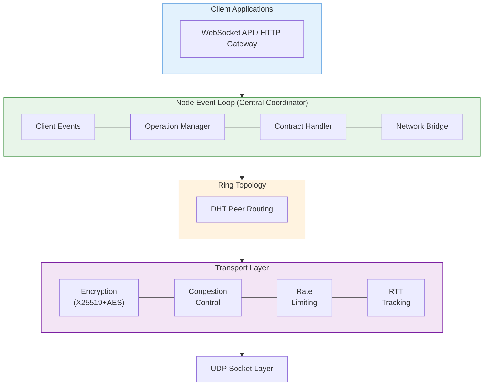

# Freenet Core Architecture

## Overview

Freenet Core is a peer-to-peer runtime that enables decentralized applications. It implements:

- **Networking stack** – UDP transport with encryption and congestion control
- **Contract execution** – WASM-based smart contracts
- **DHT routing** – Small-world network topology
- **Developer tooling** – CLI tools for building and testing

## System Architecture



## Core Components

### Node (`crates/core/src/node/`)

The central event loop that coordinates all subsystems using `tokio::select!`:

- **Event routing** – Dispatches client requests, network messages, and operation updates
- **Transaction management** – Tracks in-flight operations
- **Subsystem coordination** – Connects contracts, network, and client layers

### Operations (`crates/core/src/operations/`)

State machines for each transaction type:

| Operation | Purpose | State Machine |
|-----------|---------|---------------|
| **CONNECT** | Establish peer connections | `connect.rs` |
| **GET** | Retrieve contract state | `get.rs` |
| **PUT** | Store/publish contracts | `put.rs` |
| **UPDATE** | Propagate state changes | `update.rs` |
| **SUBSCRIBE** | Receive update notifications | `subscribe.rs` |

Each operation follows a request-response pattern with timeout and retry handling.
The `OpManager` coordinates all operation state and tracks parent-child relationships
for composite operations (e.g., PUT with SUBSCRIBE).

See [operations/README.md](operations/README.md) for detailed documentation.

### Contracts (`crates/core/src/contract/`)

WASM-based contract execution:

- **Executor** – Loads and runs WASM binaries via Wasmer
- **Handler** – Orchestrates contract operations
- **StateStore** – Persistent storage (redb/sqlite backends)
- **Runtime** – Host functions exposed to WASM (network, storage)

### Transport (`crates/core/src/transport/`)

UDP networking with security and performance features:

**Security:**
- X25519 key exchange for handshake
- ChaCha20Poly1305 for handshake encryption
- AES-128-GCM for data packets

**Congestion Control:**
| Algorithm | Use Case | Default |
|-----------|----------|---------|
| FixedRate | Stable networks | ✅ |
| LEDBAT++ | Background traffic | |
| BBRv3 | Lossy/high-latency paths | |

**Features:**
- Token bucket rate limiting
- RFC 6298 RTT estimation
- Streaming with lock-free fragment reassembly

See [transport/README.md](transport/README.md) for detailed documentation.

### Ring (`crates/core/src/ring/`)

DHT implementation with small-world routing:

- **Location-based routing** – Peers and contracts positioned on 1D ring [0, 1]
- **Connection management** – Maintains 25-200 peer connections
- **Performance-aware routing** – Learns from routing history to optimize peer selection
- **Small-world topology** – Accept-only-at-terminus creates local connections naturally

Key abstractions:
- `Location` – Ring position calculated from IP hash (peers) or contract key hash
- `ConnectionManager` – Peer organization by location
- `Router` – Performance-based peer selection

See [ring/README.md](ring/README.md) for detailed documentation.

### Server (`crates/core/src/server/`)

Client-facing APIs:

- **WebSocket API** – Primary client interface (`/v1/contract/command`)
- **HTTP Gateway** – REST endpoints for management

### Simulation (`crates/core/src/simulation/`)

Deterministic Simulation Testing (DST) framework:

| Component | Purpose |
|-----------|---------|
| `VirtualTime` | Explicit time control |
| `GlobalRng` | Seeded random generation |
| `SimulationSocket` | In-memory networking |
| `FaultConfig` | Fault injection (loss, latency, partitions) |

Uses [Turmoil](https://docs.rs/turmoil) for deterministic async scheduling.

See [testing/README.md](testing/README.md) for testing documentation.

## Request Lifecycle

Example: Client GET operation

```
1. Client sends GET request via WebSocket
2. Server wraps in OpenRequest with ClientId
3. Node event loop receives client event
4. GetOp state machine starts, assigned Transaction ID
5. Network bridge sends GetMsg to target peer
6. Transport encrypts and fragments message
7. Remote peer processes request, queries contract storage
8. Response travels back through transport
9. Node matches Transaction ID, updates state
10. Client receives ContractResponse via WebSocket
```

## Crate Structure

```
crates/
├── core/              # Main runtime
│   ├── src/
│   │   ├── bin/       # Entry points
│   │   ├── node/      # Event loop
│   │   ├── operations/# State machines
│   │   ├── contract/  # WASM execution
│   │   ├── transport/ # Networking
│   │   ├── ring/      # DHT topology
│   │   ├── server/    # Client API
│   │   └── simulation/# DST framework
│   ├── tests/         # Integration tests
│   └── benches/       # Performance benchmarks
├── fdev/              # Developer CLI
└── freenet-macros/    # Test macros (#[freenet_test])
```

## Configuration

### Runtime Configuration

```toml
[network-api]
address = "0.0.0.0:7800"
congestion-control = "fixedrate"  # or "ledbat" or "bbr"
```

### Key Defaults

| Parameter | Default | Description |
|-----------|---------|-------------|
| Per-connection bandwidth | 10 MB/s | Token bucket limit |
| Initial window | 38 KB | LEDBAT IW26 |
| Target delay | 60ms | LEDBAT congestion threshold |
| Keep-alive interval | 25s | Connection maintenance |

## Development Workflow

```bash
# Build
cargo build

# Test
cargo test -p freenet
cargo test -p freenet --test simulation_integration

# Lint
cargo fmt
cargo clippy --all-targets --all-features

# Benchmark
cargo bench --bench transport_perf -- level0
```

## Documentation Index

### Core Architecture
| Document | Description |
|----------|-------------|
| [ring/README.md](ring/README.md) | Ring/DHT topology and routing |
| [operations/README.md](operations/README.md) | Operation state machines |
| [transport/README.md](transport/README.md) | Transport layer architecture |

### Transport Details
| Document | Description |
|----------|-------------|
| [transport/security.md](transport/security.md) | Security and encryption |
| [transport/connection-lifecycle.md](transport/connection-lifecycle.md) | Connection states |
| [transport/design/ledbat-plus-plus.md](transport/design/ledbat-plus-plus.md) | LEDBAT++ congestion control |
| [transport/configuration/bandwidth-configuration.md](transport/configuration/bandwidth-configuration.md) | Bandwidth settings |

### Testing
| Document | Description |
|----------|-------------|
| [testing/README.md](testing/README.md) | Testing infrastructure |
| [testing/simulation-testing.md](testing/simulation-testing.md) | DST framework |

## External Resources

- **API Documentation:** https://docs.rs/freenet
- **User Manual:** https://freenet.org/resources/manual/
- **Repository:** https://github.com/freenet/freenet-core
