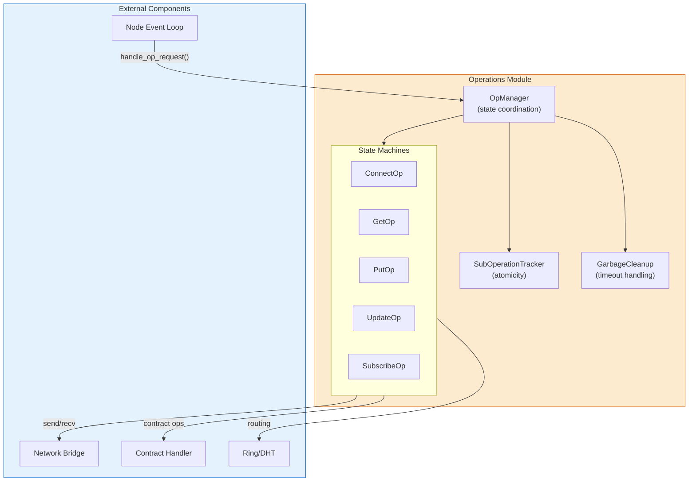
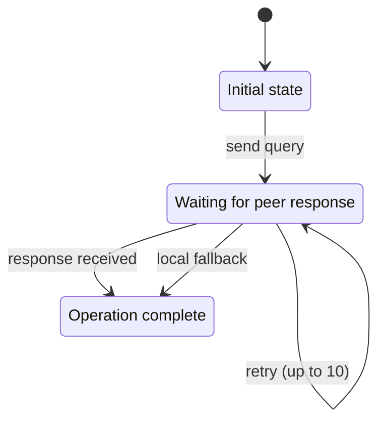
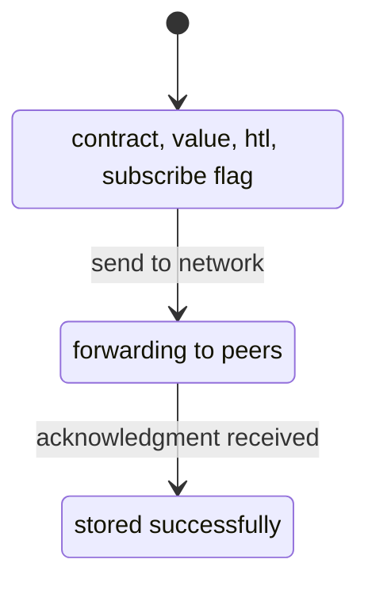
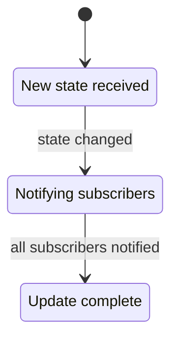
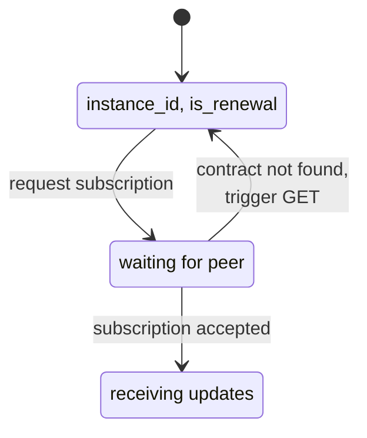
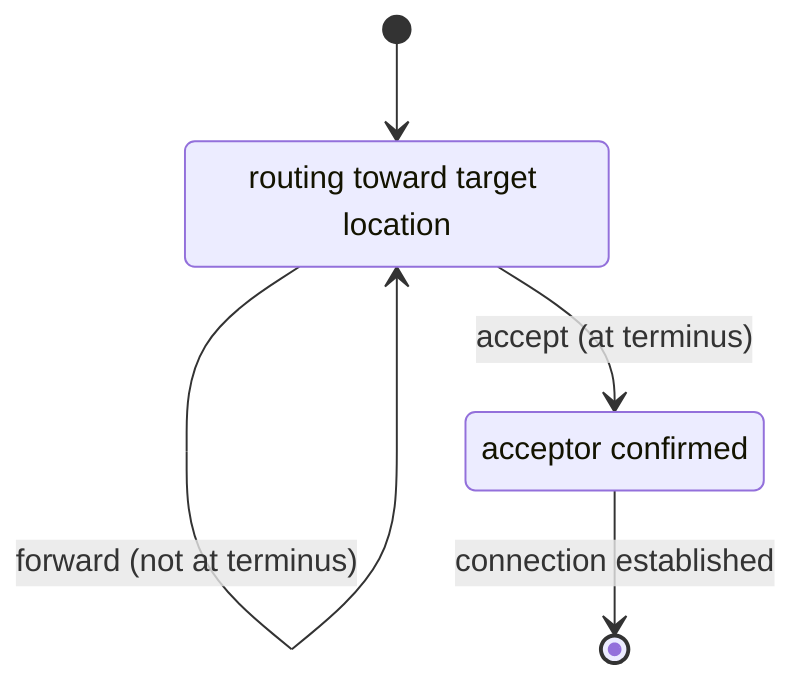
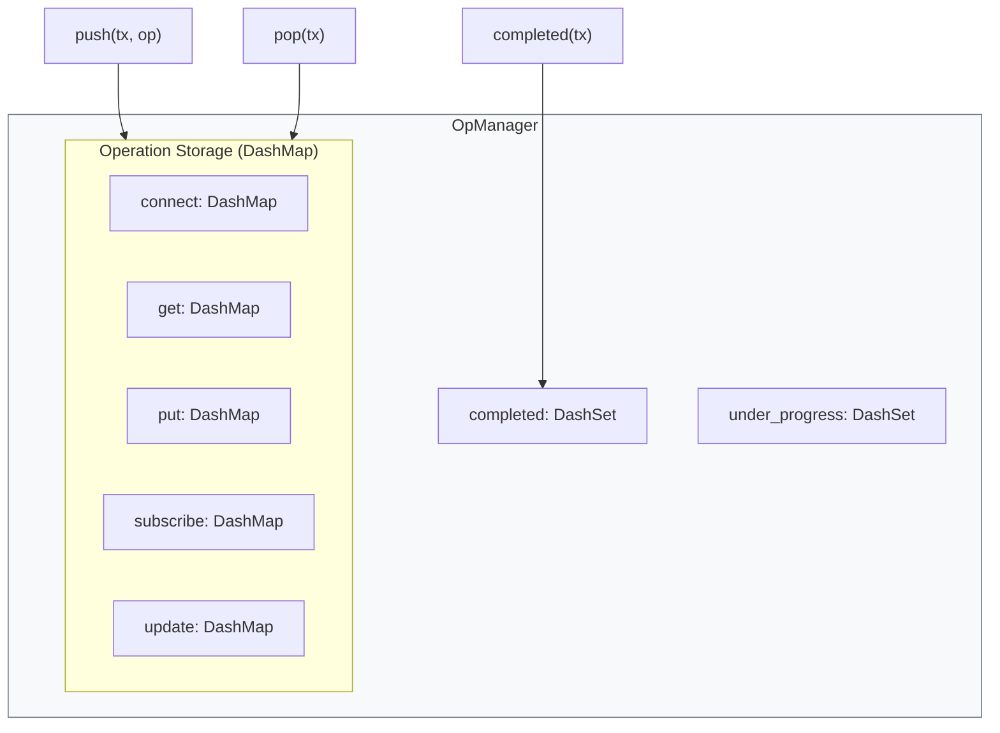
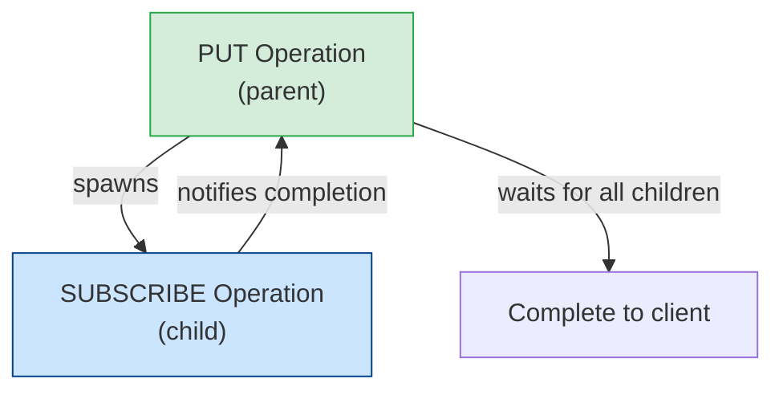
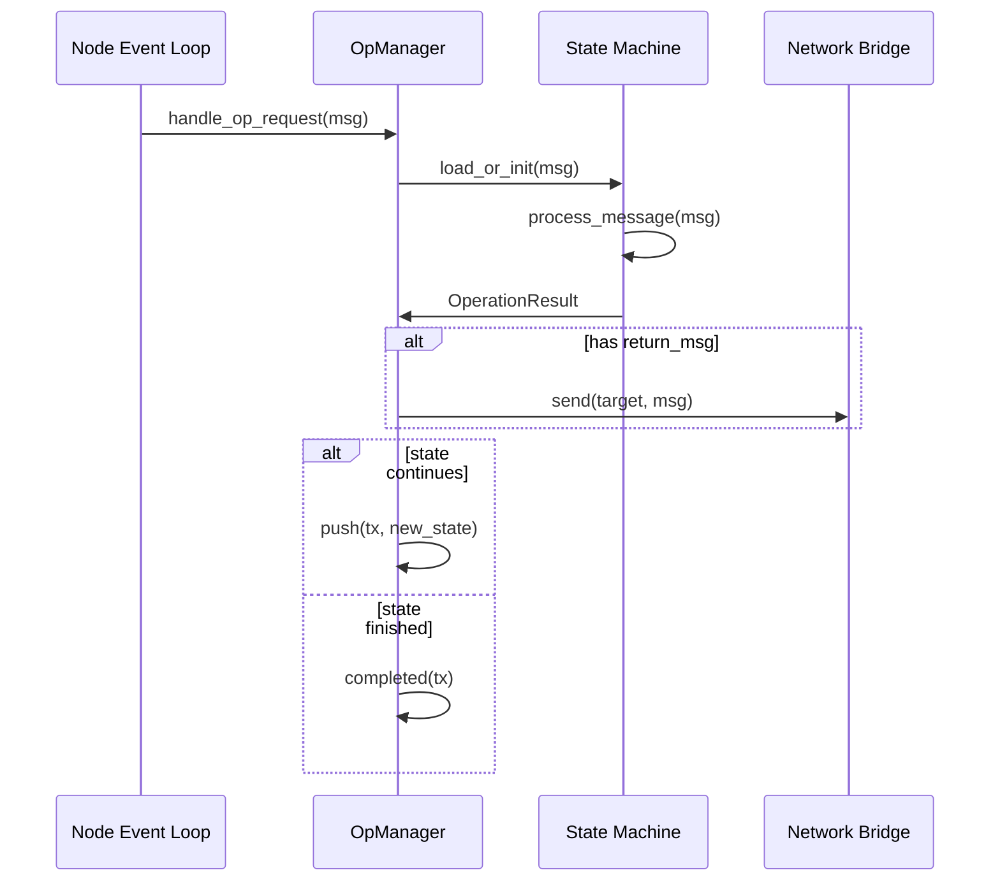
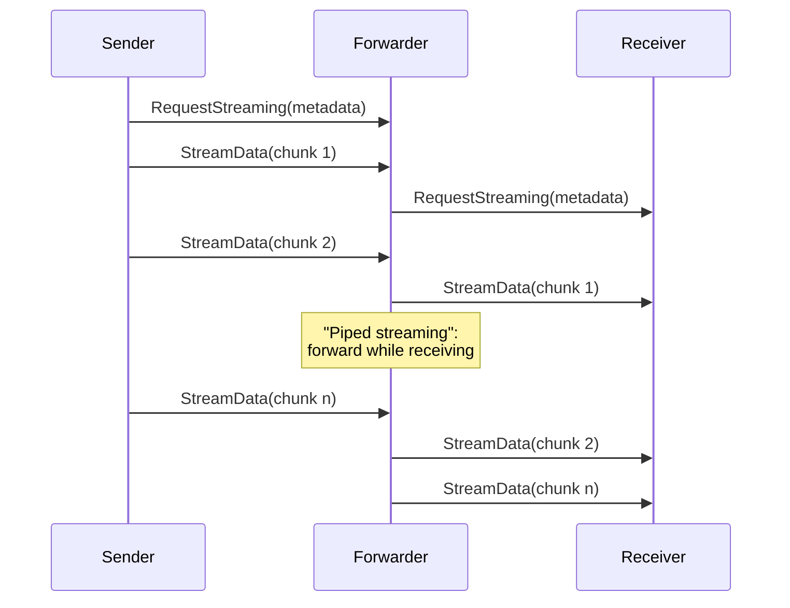

# Operations Module Architecture

## Overview

The Operations module implements state machines for all network transactions in Freenet. Each operation type follows a request-response pattern with timeout and retry handling.

**Operation types:**
- **CONNECT** - Establish peer connections
- **GET** - Retrieve contract state
- **PUT** - Store/publish contracts
- **UPDATE** - Propagate state changes
- **SUBSCRIBE** - Receive update notifications

## Architecture



## State Machine Pattern

Each operation follows the `Operation` trait:

```rust
pub trait Operation: Sized {
    type Message: InnerMessage;
    type Result;

    // Initialize from incoming message
    async fn load_or_init(
        op_manager: &OpManager,
        msg: &Self::Message,
        source_addr: Option<SocketAddr>,
    ) -> Result<OpInitialization<Self>, OpError>;

    // Process message and transition state
    fn process_message(
        self,
        conn_manager: &mut impl NetworkBridge,
        op_manager: &OpManager,
        input: &Self::Message,
    ) -> Result<OperationResult, OpError>;
}
```

**Code reference:** `crates/core/src/operations/mod.rs:32-56`

## Operation Types

### GET Operation

**Purpose:** Retrieve current contract state from network



**Key features:**
- Network-first strategy with local cache fallback
- MAX_RETRIES: 10 attempts
- MAX_BREADTH: 3 parallel peer queries per hop

**Messages:**
- `GetMsg::Request` - Query for contract
- `GetMsg::Response` - Return contract state
- `GetMsg::RequestStreaming` / `ResponseStreaming` - Large payloads

**Code reference:** `crates/core/src/operations/get.rs`

### PUT Operation

**Purpose:** Store contract and initial state in the network



**Key features:**
- Hop-by-hop routing toward contract location
- Each node caches contract locally
- Optional subscription after PUT completes
- Streaming for payloads > 64KB

**Messages:**
- `PutMsg::Request` - Store contract
- `PutMsg::Response` - Acknowledgment
- Streaming variants for large payloads

**Subscription integration:**
- Async mode (default): subscription completes in background
- Blocking mode: PUT waits for subscription before responding

**Code reference:** `crates/core/src/operations/put.rs`

### UPDATE Operation

**Purpose:** Propagate state changes to subscribers



**Key features:**
- Triggered by contract state changes
- Broadcasts to all active subscribers
- No retry logic (broadcast-based delivery)

**Trigger flow:**
1. Contract executor detects state change
2. Emits `BroadcastStateChange` event
3. UPDATE operation created and broadcast

**Code reference:** `crates/core/src/operations/update.rs`

### SUBSCRIBE Operation

**Purpose:** Receive notifications of contract state changes



**Key features:**
- Routes toward contract location
- Handles race condition: subscription before PUT
- 2-second timeout waiting for contract

**Race condition handling:**
```
SUBSCRIBE arrives → contract not found
  → wait_for_contract_with_timeout(2s)
  → if still missing: trigger GET
  → then complete subscription
```

**Code reference:** `crates/core/src/operations/subscribe.rs`

### CONNECT Operation

**Purpose:** Establish peer-to-peer connections



**Key features:**
- Accept-only-at-terminus rule (creates local connections)
- NAT traversal via ObservedAddress message
- First relay discovers joiner's external IP

**Message flow:**
```
Joiner → Gateway → Relay → Acceptor
                          ↓
Joiner ← Gateway ← Relay ← ConnectResponse
     ↑
  ObservedAddress (NAT discovery)
```

**Acceptance criteria:**
1. Can forward to closer peer? → Forward only
2. At terminus + below min_connections → Accept
3. At terminus + at max_connections → Reject
4. At terminus + between limits → Density-based evaluation

**Code reference:** `crates/core/src/operations/connect.rs`

## OpManager: Operation Coordination

The `OpManager` coordinates all operation state:



**Key methods:**

| Method | Purpose |
|--------|---------|
| `push(tx, op)` | Store operation state |
| `pop(tx)` | Retrieve for processing |
| `completed(tx)` | Mark operation finished |
| `notify_op_change(msg, op)` | Fast path for state transitions |

**Code reference:** `crates/core/src/node/op_state_manager.rs:207-257`

## Transaction Tracking

Each operation has a unique `Transaction` identifier:

```rust
pub struct Transaction {
    id: Ulid,              // Unique ID (timestamp + randomness)
    parent: Option<Ulid>,  // Parent for sub-operations
}
```

**Transaction type encoding** (in ULID last byte):
- `0` = CONNECT
- `1` = PUT
- `2` = GET
- `3` = SUBSCRIBE
- `4` = UPDATE

**Lifecycle:**
```
Created → Pushed → Under Progress → Completed
                        ↓
              Garbage Cleanup (if timeout)
```

**Code reference:** `crates/core/src/message.rs:35-82`

## Sub-Operation Tracking

Composite operations (e.g., PUT with SUBSCRIBE) use parent-child tracking:



**SubOperationTracker methods:**
- `expect_and_register_sub_operation(parent, child)` - Pre-register child
- `all_sub_operations_completed(parent)` - Check if ready
- `sub_operation_failed(child, error)` - Propagate failure

**Code reference:** `crates/core/src/node/op_state_manager.rs:61-192`

## Error Handling

### OpError Variants

| Error | Cause | Handling |
|-------|-------|----------|
| `ConnError` | Network connection failed | Retry with backoff |
| `RingError` | DHT routing failed | Fall back to local |
| `ContractError` | Contract execution failed | Return to client |
| `InvalidStateTransition` | Unexpected message | Log and skip |
| `OpNotPresent` | Duplicate/late message | Ignore (benign) |
| `StreamCancelled` | Transfer interrupted | Abort operation |

### Timeout Handling

Operations have implicit TTL based on creation time:

```
1. Transaction created with timestamp
2. Garbage cleanup task runs every 5 seconds
3. Checks: elapsed >= OPERATION_TTL
4. If timed out: remove from storage, notify client
```

**Code reference:** `crates/core/src/node/op_state_manager.rs:938-1050`

## Critical Invariants

### Push-Before-Send

State must be persisted before sending messages:

```rust
// CORRECT ORDER:
op_manager.push(tx, updated_state).await?;  // 1. Save state
network_bridge.send(target, msg).await?;    // 2. Send message

// If reversed: fast response could arrive before state saved
```

**Why:** Prevents race condition where response arrives before state is stored.

### Visited Peers (Privacy-Preserving)

The `VisitedPeers` bloom filter tracks visited peers during GET/SUBSCRIBE:

| Peers | False Positive Rate |
|-------|-------------------|
| 10 | ~0.006% (1 in 17,000) |
| 20 | ~0.04% (1 in 2,500) |
| 30 | ~0.2% (1 in 500) |

**Privacy feature:** Hash keys derived from transaction ID, so same peer hashes differently in different transactions.

**Code reference:** `crates/core/src/operations/visited_peers.rs`

## Message Flow

### Request Processing



### Streaming Support

Large payloads (> streaming_threshold) use streaming:



**Piped streaming:** Forwarders can forward data while still receiving, reducing latency.

**Code reference:** `crates/core/src/operations/put.rs:786-1024`

## Configuration

| Parameter | Default | Description |
|-----------|---------|-------------|
| `streaming_threshold` | 64 KB | Size threshold for streaming |
| `OPERATION_TTL` | configurable | Operation timeout |
| `MAX_RETRIES` | 10 | GET retry attempts |
| `MAX_BREADTH` | 3 | Parallel peer queries |
| `CONTRACT_WAIT_TIMEOUT_MS` | 2000 | SUBSCRIBE wait for contract |

## Source Files

| File | Purpose |
|------|---------|
| `operations/mod.rs` | Core traits and orchestration |
| `operations/connect.rs` | CONNECT state machine |
| `operations/get.rs` | GET state machine |
| `operations/put.rs` | PUT state machine |
| `operations/update.rs` | UPDATE state machine |
| `operations/subscribe.rs` | SUBSCRIBE state machine |
| `operations/visited_peers.rs` | Privacy-preserving bloom filter |
| `node/op_state_manager.rs` | OpManager implementation |
| `message.rs` | Transaction and message types |

## References

- [Ring/DHT Architecture](../ring/README.md) - Routing decisions
- [Transport Layer](../transport/README.md) - Network communication
- [Testing](../testing/README.md) - DST with operation validation
