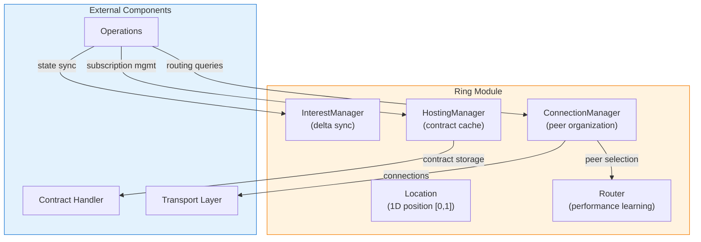
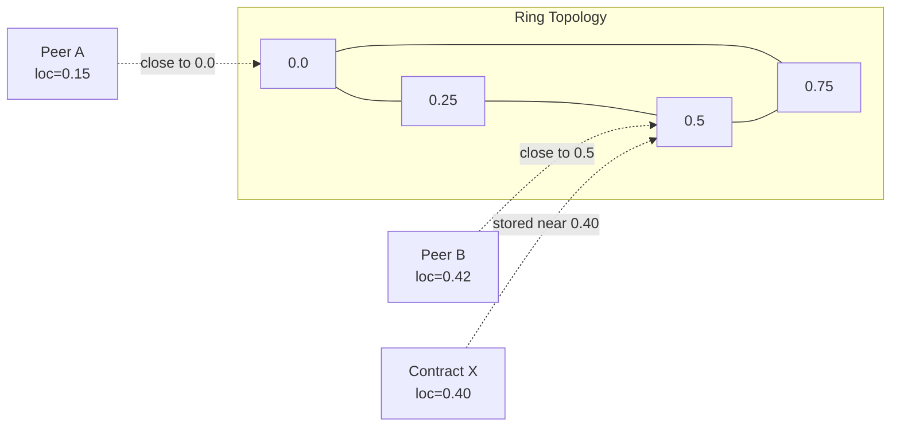
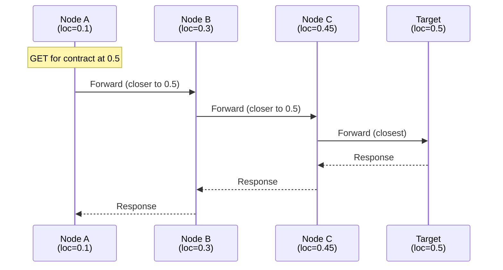
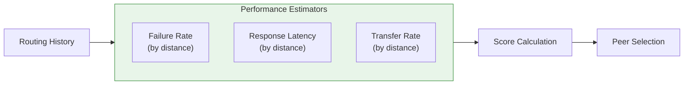
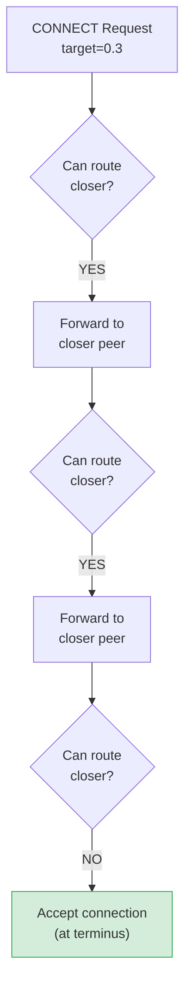
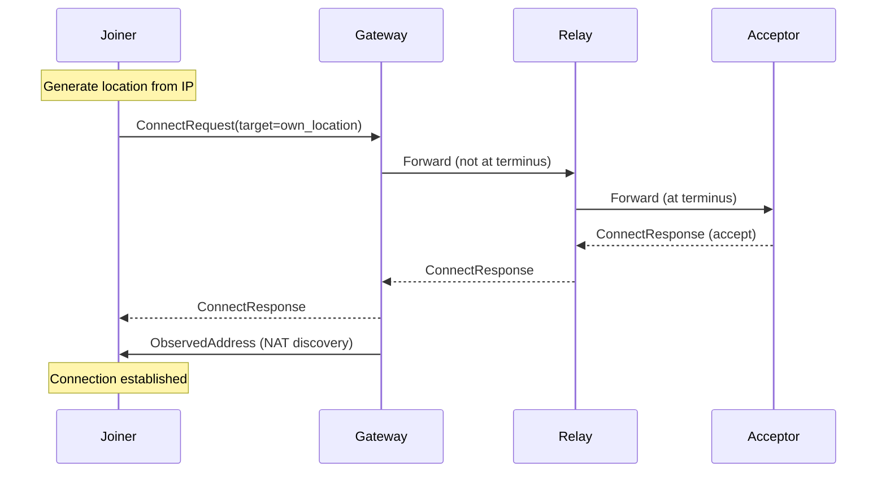
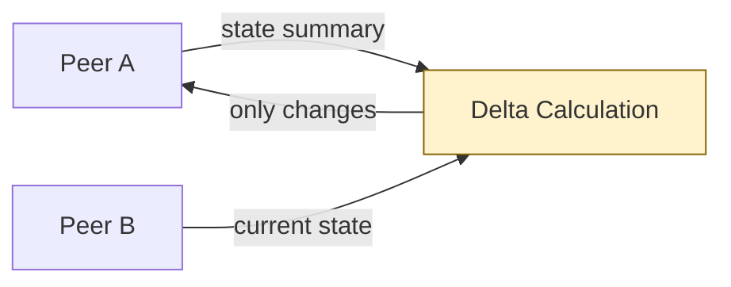

# Ring/DHT Architecture

## Overview

The Ring module implements Freenet's Distributed Hash Table (DHT) with small-world network properties. It provides:

- **Location-based routing** - Peers and contracts positioned on a 1D circular ring [0, 1]
- **Small-world topology** - High clustering with low average path length
- **Self-organizing connections** - Automatic neighbor discovery and maintenance
- **Performance-aware routing** - Learns from routing history to optimize peer selection

## Architecture



## Core Concepts

### Location: Ring Positioning

Every peer and contract has a `Location` on a circular ring normalized to [0, 1]:



**Location calculation:**
- **Peers:** Hash of IP address (masked for sybil resistance)
- **Contracts:** Hash of contract key

**Distance:** Shortest path on circular ring
```
distance(0.1, 0.9) = 0.2  // wraps around
distance(0.1, 0.3) = 0.2  // direct path
```

**Code reference:** `crates/core/src/ring/location.rs:12-79`

### Connection Organization

The `ConnectionManager` maintains peer connections organized by location:

| Structure | Type | Purpose |
|-----------|------|---------|
| `connections_by_location` | BTreeMap<Location, Vec<Connection>> | Peers grouped by ring position |
| `location_for_peer` | BTreeMap<SocketAddr, Location> | Reverse lookup |
| `pending_reservations` | BTreeMap<SocketAddr, Location> | Handshake in progress |

**Connection states:**
1. **Pending** - Handshake in progress
2. **Active** - Fully established, used for routing
3. **Transient** - Unsolicited inbound (gateways only)

**Limits:**
- MIN_CONNECTIONS: 25 (always accept below this)
- MAX_CONNECTIONS: 200 (reject above this)

**Code reference:** `crates/core/src/ring/connection_manager.rs:23-45`

## Routing

### Greedy Routing Algorithm

Messages are routed toward target location using greedy forwarding:



**Algorithm:**
1. Get all connected peers
2. Filter out: requester, visited peers, transient connections
3. Select peer closest to target location
4. Forward message to that peer

**Random walk fallback:** When HTL > 7, randomly select next hop to ensure diversity.

**Code reference:** `crates/core/src/ring/connection_manager.rs:767-830`

### Performance-Aware Routing

The `Router` learns from routing outcomes to predict peer performance:



**Score calculation:**
```
score = (1 - failure_probability) × (1 / latency) × transfer_rate
```

**Code reference:** `crates/core/src/router/mod.rs:15-200`

## Small-World Properties

### Accept-Only-at-Terminus Rule

The key insight that creates small-world structure:



**Result:** Connections naturally form between nearby peers without explicit radius checks.

**Example:**
```
Joiner (0.5) sends request toward location 0.3
├─ Gateway (0.7) [can route to 0.6] → FORWARDS
├─ Node A (0.6) [can route to 0.4] → FORWARDS
├─ Node B (0.4) [can route to 0.35] → FORWARDS
└─ Node C (0.35) [no closer peer] → ACCEPTS ✓

Result: Joiner connects to Node C (distance = 0.15)
```

**Code reference:** `crates/core/src/operations/connect.rs:13-72`

### Why Small-World Works

The topology achieves:

1. **High clustering** - Most connections are local (nearby on ring)
2. **Low diameter** - Few long-range links enable O(log n) path lengths
3. **Robustness** - No single point of failure

**Connection distribution:**
- Very local (distance < 0.1): Many connections from terminus rule
- Local (0.1-0.3): Moderate connections
- Long-range (> 0.3): Rare but critical for short paths

## Bootstrap Process

### New Node Joining



**Phases:**
1. **Request routing** - CONNECT routed toward target location
2. **NAT discovery** - First relay observes external address
3. **Connection establishment** - Acceptor at terminus connects

**Early phase (0-4 connections):**
- Target own location repeatedly
- Creates local neighborhood

**Later phase (4+ connections):**
- Density-based targeting
- Optimize for request patterns

**Code reference:** `crates/core/src/operations/connect.rs:74-90`

## Hosting and Subscriptions

### Contract Hosting

The `HostingManager` maintains an LRU cache of hosted contracts:

| Parameter | Default | Description |
|-----------|---------|-------------|
| Budget | 100 MB | Maximum hosted contract size |
| Min TTL | 300s | Recently accessed contracts protected |

**Operations:**
- `seed_contract()` - Add to hosting cache
- `host_contract()` - Record access (updates TTL)
- `should_host()` - Check if should continue hosting

### Subscription Leases

Subscriptions are lease-based with automatic renewal:

| Parameter | Value | Description |
|-----------|-------|-------------|
| Lease duration | 8 min | Time until subscription expires |
| Renewal interval | 2 min | How often to renew |
| Check interval | 30s | Background task frequency |

**Code reference:** `crates/core/src/ring/hosting.rs:48-66`

## Interest-Based Synchronization

The `InterestManager` enables efficient delta-based state sync:



**Features:**
- Hash-based contract discovery
- Delta sent only if < 50% of full state
- TTL-based interest expiry (5 minutes)

**Code reference:** `crates/core/src/ring/interest.rs`

## Key APIs

### Ring

| Method | Purpose |
|--------|---------|
| `open_connections()` | Current connection count |
| `k_closest_potentially_caching()` | Find k best peers for contract |
| `subscribe()` / `unsubscribe()` | Subscription management |
| `seed_contract()` / `host_contract()` | Hosting cache management |
| `is_hosting_contract()` | Check if hosting |

### ConnectionManager

| Method | Purpose |
|--------|---------|
| `should_accept()` | Evaluate new connection |
| `add_connection()` | Register established connection |
| `routing()` | Select next hop for message |
| `prune_alive_connection()` | Disconnect from peer |

### Location

| Method | Purpose |
|--------|---------|
| `from_address()` | Hash IP to location |
| `distance()` | Ring distance calculation |
| `random()` | Generate random location |

## Configuration

| Parameter | Default | Description |
|-----------|---------|-------------|
| `min_connections` | 25 | Minimum maintained connections |
| `max_connections` | 200 | Maximum allowed connections |
| `max_hops_to_live` | 10 | Maximum routing hops |
| `rand_walk_above_htl` | 7 | HTL threshold for random walk |

## Source Files

| File | Purpose |
|------|---------|
| `ring/mod.rs` | Main Ring orchestrator |
| `ring/connection_manager.rs` | Peer connection management |
| `ring/location.rs` | Location abstraction |
| `ring/peer_key_location.rs` | Peer identity + location |
| `ring/hosting.rs` | Contract hosting cache |
| `ring/interest.rs` | Interest-based sync |
| `ring/connection_backoff.rs` | Exponential backoff |
| `router/mod.rs` | Performance-aware routing |

## References

- [Connect Operation](../operations/README.md#connect-operation) - Bootstrap protocol
- [Transport Security](../transport/security.md) - Connection encryption
- [Testing](../testing/README.md) - DST with topology validation
