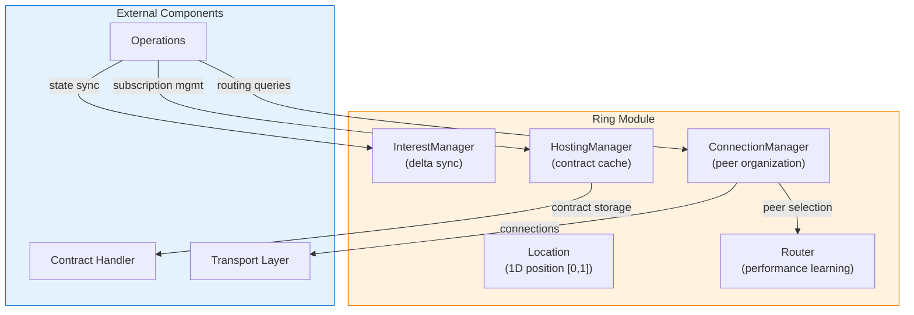
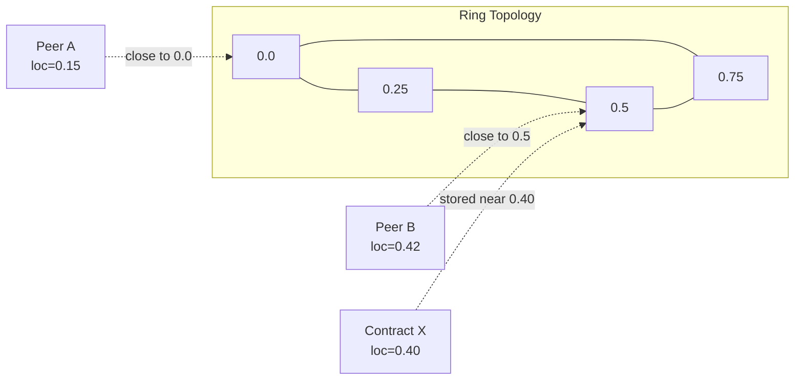
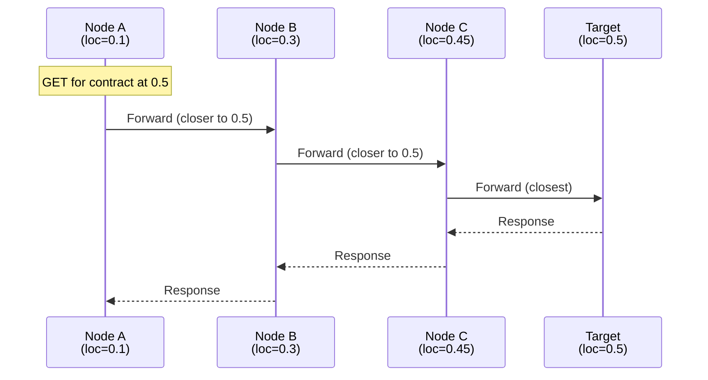
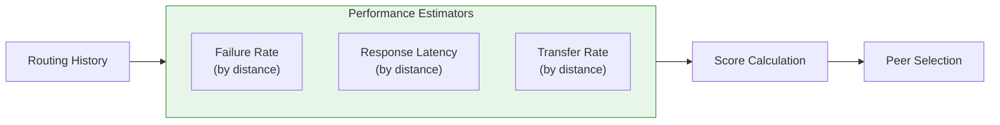
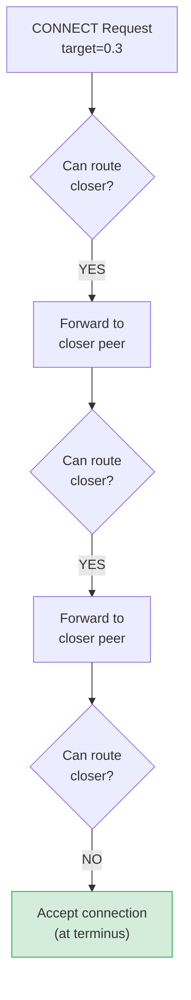
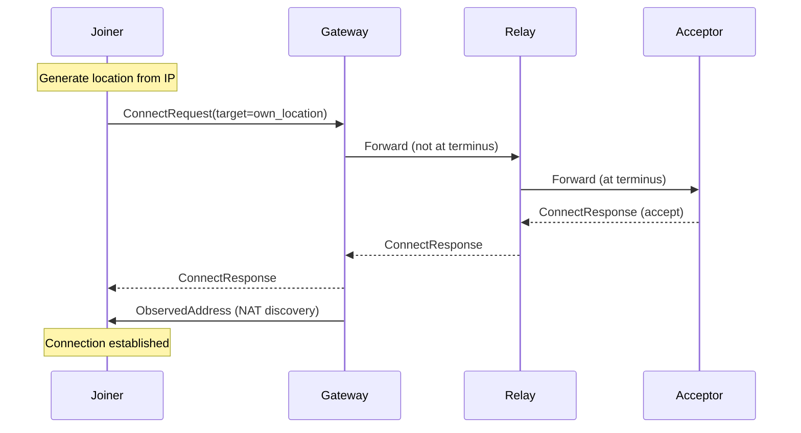
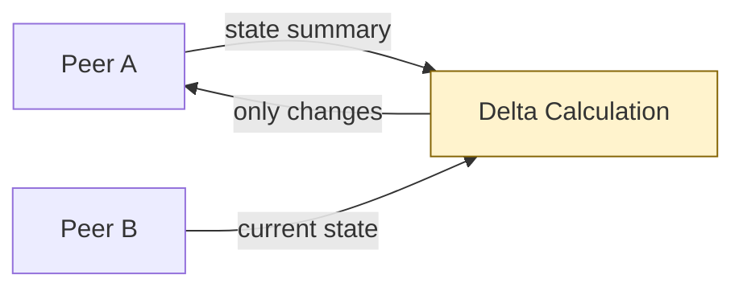

# Ring/DHT Architecture

## Overview

The Ring module implements Freenet's Distributed Hash Table (DHT) with small-world network properties. It provides:

- **Location-based routing** - Peers and contracts positioned on a 1D circular ring [0, 1]
- **Small-world topology** - Kleinberg 1/d connection distribution for short greedy routes
- **Self-organizing connections** - Automatic neighbor discovery and maintenance
- **Performance-aware routing** - Learns from routing history to optimize peer selection

## Architecture


```mermaid
flowchart TB
    subgraph Ring["Ring Module"]
        Location["Location<br/>(1D position [0,1])"]
        ConnMgr["ConnectionManager<br/>(peer organization)"]
        Router["Router<br/>(performance learning)"]
        Hosting["HostingManager<br/>(contract cache)"]
        Interest["InterestManager<br/>(delta sync)"]
    end

    subgraph External["External Components"]
        Transport["Transport Layer"]
        Operations["Operations"]
        Contracts["Contract Handler"]
    end

    Operations -->|"routing queries"| ConnMgr
    ConnMgr -->|"peer selection"| Router
    Operations -->|"subscription mgmt"| Hosting
    Operations -->|"state sync"| Interest
    ConnMgr -->|"connections"| Transport
    Hosting -->|"contract storage"| Contracts

    style Ring fill:#fff3e0,stroke:#f57c00
    style External fill:#e3f2fd,stroke:#1976d2
```

## Core Concepts

### Location: Ring Positioning

Every peer and contract has a `Location` on a circular ring normalized to [0, 1]:


```mermaid
flowchart LR
    subgraph Ring["Ring Topology"]
        direction TB
        L0["0.0"]
        L25["0.25"]
        L5["0.5"]
        L75["0.75"]
        L0 --- L25 --- L5 --- L75 --- L0
    end

    P1["Peer A<br/>loc=0.15"]
    P2["Peer B<br/>loc=0.42"]
    C1["Contract X<br/>loc=0.40"]

    P1 -.->|"close to 0.0"| L0
    P2 -.->|"close to 0.5"| L5
    C1 -.->|"stored near 0.40"| L5
```

**Location calculation:**
- **Peers:** Hash of IP address (masked for sybil resistance)
- **Contracts:** Hash of contract key

**Distance:** Shortest path on circular ring
```
distance(0.1, 0.9) = 0.2  // wraps around
distance(0.1, 0.3) = 0.2  // direct path
```

**Code reference:** `crates/core/src/ring/location.rs:12-79`

### Connection Organization

The `ConnectionManager` maintains peer connections organized by location:

| Structure | Type | Purpose |
|-----------|------|---------|
| `connections_by_location` | BTreeMap<Location, Vec<Connection>> | Peers grouped by ring position |
| `location_for_peer` | BTreeMap<SocketAddr, Location> | Reverse lookup |
| `pending_reservations` | BTreeMap<SocketAddr, Location> | Handshake in progress |

**Connection states:**
1. **Pending** - Handshake in progress
2. **Active** - Fully established, used for routing
3. **Transient** - Unsolicited inbound (gateways only)

**Limits:**
- MIN_CONNECTIONS: 25 (always accept below this)
- MAX_CONNECTIONS: 200 (reject above this)

**Code reference:** `crates/core/src/ring/connection_manager.rs:23-45`

## Routing

### Greedy Routing Algorithm

Messages are routed toward target location using greedy forwarding:


```mermaid
sequenceDiagram
    participant A as Node A<br/>(loc=0.1)
    participant B as Node B<br/>(loc=0.3)
    participant C as Node C<br/>(loc=0.45)
    participant T as Target<br/>(loc=0.5)

    Note over A: GET for contract at 0.5
    A->>B: Forward (closer to 0.5)
    B->>C: Forward (closer to 0.5)
    C->>T: Forward (closest)
    T-->>C: Response
    C-->>B: Response
    B-->>A: Response
```

**Algorithm:**
1. Get all connected peers
2. Filter out: requester, visited peers, transient connections
3. Select peer closest to target location
4. Forward message to that peer

**Random walk fallback:** When HTL > 7, randomly select next hop to ensure diversity.

**Code reference:** `crates/core/src/ring/connection_manager.rs:767-830`

### Performance-Aware Routing

The `Router` learns from routing outcomes to predict peer performance:


```mermaid
flowchart LR
    subgraph Estimators["Performance Estimators"]
        Fail["Failure Rate<br/>(by distance)"]
        Latency["Response Latency<br/>(by distance)"]
        Rate["Transfer Rate<br/>(by distance)"]
    end

    History["Routing History"] --> Estimators
    Estimators --> Score["Score Calculation"]
    Score --> Selection["Peer Selection"]

    style Estimators fill:#e8f5e9,stroke:#388e3c
```

**Score calculation:**
```
score = (1 - failure_probability) × (1 / latency) × transfer_rate
```

**Code reference:** `crates/core/src/router.rs:15-200`

## Small-World Properties

### Kleinberg 1/d Topology

Greedy routing on a ring finds short paths when each peer's connection distances follow
Kleinberg's 1/d distribution. That distribution is uniform in log-distance: each decade of
ring distance (0.001-0.01, 0.01-0.1, ...) should hold roughly the same share of a peer's
connections, out to the maximum ring distance of 0.5. Freenet builds this explicitly by analyzing each peer's existing
connection distances in log-distance space:

| Mechanism | What it does | Code |
|-----------|--------------|------|
| Gap-based targeting | New outbound CONNECTs target the center of the largest gap in log-distance coverage | `small_world_rand::gap_target`, `gap_target_directional` |
| Directional coverage | Steady-state targeting, swaps and pruning analyze clockwise and counter-clockwise half-rings independently | `gap_target_directional`, `largest_gap_size_directional`, `removal_gap_directional` |
| Random Kleinberg samples | When several targets are requested at once (below `min_connections`), `sample_targets` alternates gap targets with random 1/d samples to discover peers via different routes; single steady-state additions are pure gap targets | `small_world_rand::kleinberg_target`, `TopologyManager::sample_targets` |
| Kleinberg gap score | Inbound candidates are scored by how much they fill a gap in log-distance coverage | `small_world_rand::kleinberg_score`, `ConnectionManager::should_accept` |
| Topology swaps | At steady state, a connection may be replaced by one targeting the largest gap, with probability proportional to how far that gap exceeds the expected `ln(k)/k` | `TopologyManager::maybe_swap_connection` |
| Protected pruning | Peers whose removal would open a gap more than 2x the expected size are excluded from composite-score pruning and from swaps. A fallback drops the lowest-topology-value peer when every removal candidate is protected, or when over `max_connections` and composite pruning finds no candidate | `TopologyManager::select_connections_to_remove`, `TOPOLOGY_PROTECTION_THRESHOLD` |

In addition, peers configured with `max_connections` of at least 25 (production uses 200)
maintain their nearest ring neighbor on each side (the nearest-neighbor lattice): a new
nearest neighbor is admitted even at capacity (up to a small over-max allowance), lattice
edges are excluded from score-based pruning and swaps, and a periodic route-to-self probe
keeps discovering closer neighbors. Once a probe on each side has found nothing closer than the
current nearest neighbor, the probe sleeps until a nearest-neighbor distance changes, so a
converged peer does not keep adding non-lattice links.

**Acceptance:**
- At `max_connections` → reject (except new nearest-neighbor lattice edges)
- Below `min_connections`: always accept below 3 open connections; above that, accept with
  probability `floor + gap_score`, where the floor slides from 0.9 down to 0.3 as the peer
  approaches `min_connections`
- At/above `min_connections`: the gap score is fed to the `ConnectionEvaluator`, which accepts
  a candidate only if it beats the other candidates seen in a recent time window

**Code reference:** `crates/core/src/topology.rs` (module docs, `adjust_topology`),
`crates/core/src/topology/small_world_rand.rs`, `crates/core/src/ring/connection_manager.rs`
(`should_accept`)

### Where CONNECT Requests Are Accepted

A CONNECT request is greedily routed toward its target location. A relay accepts when it
cannot forward to a peer closer to the target (the terminus); a relay within 0.05 of the
target may also accept probabilistically while still forwarding. If the terminus declines
(for example because the joiner is already connected there, or it is at capacity), the
request routes uphill, bounded by an uphill budget, and a farther peer may accept.


```mermaid
flowchart TD
    Start["CONNECT Request<br/>target=0.3"] --> R1{Can route<br/>closer?}
    R1 -->|YES| F1["Forward to<br/>closer peer"]
    F1 --> R2{Can route<br/>closer?}
    R2 -->|YES| F2["Forward to<br/>closer peer"]
    F2 --> R3{Can route<br/>closer?}
    R3 -->|NO| Accept["Accept connection<br/>(at terminus)"]

    style Accept fill:#d4edda,stroke:#28a745
```

This ensures the new connection lands near the target the joiner chose, rather than at the
gateway or an early relay. It does not by itself produce a small-world distribution: the
distance distribution comes from target selection and the acceptance gap score above.

**Example:**
```
Joiner (0.5) sends request toward location 0.3
├─ Gateway (0.7) [can route to 0.6] → FORWARDS
├─ Node A (0.6) [can route to 0.4] → FORWARDS
├─ Node B (0.4) [can route to 0.35] → FORWARDS
└─ Node C (0.35) [no closer peer] → ACCEPTS ✓

Result: Joiner connects to Node C, near its chosen target 0.3
```

**Code reference:** `crates/core/src/operations/connect.rs` (module docs, `RelayState::step`)

## Bootstrap Process

### New Node Joining


```mermaid
sequenceDiagram
    participant J as Joiner
    participant G as Gateway
    participant R as Relay
    participant A as Acceptor

    Note over J: Generate location from IP
    J->>G: ConnectRequest(target=own_location)
    G->>R: Forward (not at terminus)
    R->>A: Forward (at terminus)
    A-->>R: ConnectResponse (accept)
    R-->>G: ConnectResponse
    G-->>J: ConnectResponse
    G->>J: ObservedAddress (NAT discovery)
    Note over J: Connection established
```

**Phases:**
1. **Request routing** - CONNECT routed toward target location
2. **NAT discovery** - First relay observes external address
3. **Connection establishment** - Acceptor at terminus connects

**Target selection in `join_ring_request`** (gateway joins, cached-peer reconnects, the
startup loop):
- Fewer than 3 connections: target own location, with jitter after consecutive failures
- 3+ connections: target the center of the largest gap in log-distance coverage
  (`small_world_rand::gap_target`)

**Target selection by ring maintenance** (`TopologyManager::adjust_topology`):
- Fewer than 5 connections (and below `min_connections`): own location, then evenly
  spaced ring locations
- Otherwise: directional gap targets, alternating with random Kleinberg 1/d samples when
  several targets are requested at once

**Code reference:** `crates/core/src/operations/connect.rs` (`join_ring_request`),
`crates/core/src/topology.rs` (`adjust_topology`, `sample_targets`,
`bootstrap_target_locations`)

## Hosting and Subscriptions

### Contract Hosting

The `HostingManager` maintains an LRU cache of hosted contracts:

| Parameter | Default | Description |
|-----------|---------|-------------|
| Budget | 100 MB | Maximum hosted contract size |
| Min TTL | 300s | Recently accessed contracts protected |

**Operations:**
- `host_contract()` - Add to hosting cache
- `host_contract()` - Record access (updates TTL)
- `should_host()` - Check if should continue hosting

### Subscription Leases

Subscriptions are lease-based with automatic renewal:

| Parameter | Value | Description |
|-----------|-------|-------------|
| Lease duration | 8 min | Time until subscription expires |
| Renewal interval | 2 min | How often to renew |
| Check interval | 30s | Background task frequency |

**Code reference:** `crates/core/src/ring/hosting.rs:48-66`

## Interest-Based Synchronization

The `InterestManager` enables efficient delta-based state sync:


```mermaid
flowchart LR
    P1["Peer A"] -->|"state summary"| Calc["Delta Calculation"]
    P2["Peer B"] -->|"current state"| Calc
    Calc -->|"only changes"| P1

    style Calc fill:#fff3cd,stroke:#856404
```

**Features:**
- Hash-based contract discovery
- Delta sent only if < 50% of full state
- TTL-based interest expiry (20 min) with periodic heartbeat refresh (5 min)

**Code reference:** `crates/core/src/ring/interest.rs`

## Key APIs

### Ring

| Method | Purpose |
|--------|---------|
| `open_connections()` | Current connection count |
| `k_closest_potentially_hosting()` | Find k best peers for contract |
| `subscribe()` / `unsubscribe()` | Subscription management |
| `host_contract()` | Hosting cache management |
| `is_hosting_contract()` | Check if hosting |

### ConnectionManager

| Method | Purpose |
|--------|---------|
| `should_accept()` | Evaluate new connection |
| `add_connection()` | Register established connection |
| `routing()` | Select next hop for message |
| `prune_alive_connection()` | Disconnect from peer |

### Location

| Method | Purpose |
|--------|---------|
| `from_address()` | Hash IP to location |
| `distance()` | Ring distance calculation |
| `random()` | Generate random location |

## Configuration

| Parameter | Default | Description |
|-----------|---------|-------------|
| `min_connections` | 25 | Minimum maintained connections |
| `max_connections` | 200 | Maximum allowed connections |
| `max_hops_to_live` | 10 | Maximum routing hops |
| `rand_walk_above_htl` | 7 | HTL threshold for random walk |

## Source Files

| File | Purpose |
|------|---------|
| `ring.rs` | Main Ring orchestrator |
| `ring/connection_manager.rs` | Peer connection management |
| `ring/location.rs` | Location abstraction |
| `ring/peer_key_location.rs` | Peer identity + location |
| `ring/hosting.rs` | Contract hosting cache |
| `ring/interest.rs` | Interest-based sync |
| `ring/connection_backoff.rs` | Exponential backoff |
| `router.rs` | Performance-aware routing |

## References

- [Connect Operation](../operations/README.md#connect-operation) - Bootstrap protocol
- [Transport Security](../transport/security.md) - Connection encryption
- [Testing](../testing/README.md) - DST with topology validation
