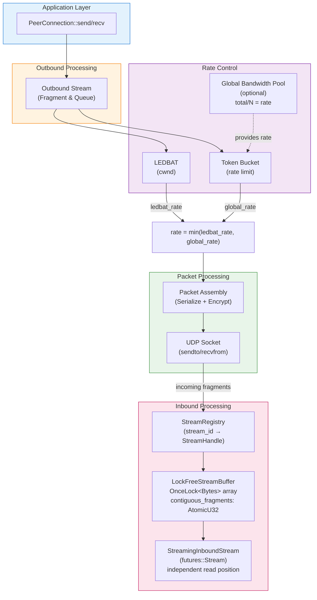

# Freenet Transport Layer Documentation

## Overview

The Freenet transport layer provides low-level network communication over UDP with:
- **Encryption**: X25519 key exchange with ChaCha20Poly1305 for handshake, AES-128-GCM for data packets
- **Reliability**: Packet acknowledgment, retransmission, and Tail Loss Probe (RFC 8985)
- **Congestion Control**: Multiple algorithms available (LEDBAT++, BBRv3, FixedRate) - see [Congestion Control Algorithms](#congestion-control-algorithms)
- **Rate Limiting**: Token bucket for smooth packet pacing
- **RTT Tracking**: RFC 6298-compliant RTT estimation with Karn's algorithm

## Implementation Status

| Component | Status | Week Completed |
|-----------|--------|----------------|
| RTT Estimation (RFC 6298) | ✅ Complete | Week 1 |
| Token Bucket Rate Limiter | ✅ Complete | Week 2 |
| LEDBAT Controller (RFC 6817) | ✅ Complete | Week 3 |
| Slow Start (IW26) | ✅ Complete | Week 4 |
| cwnd Enforcement | ✅ Complete | Week 4 |
| Bandwidth Configuration | ✅ Complete | Week 4 |
| Global Bandwidth Pool | ✅ Complete | Week 5 |
| Streaming Infrastructure (Phase 1) | ✅ Complete | Week 6 |
| LEDBAT++ (draft-irtf-iccrg-ledbat-plus-plus) | ✅ Complete | Week 7 |

## Document Map

### Core Architecture
Essential architecture documentation for understanding the transport layer.

- **[Security Architecture](security.md)** - Encryption protocol (X25519 + ChaCha20Poly1305 + AES-GCM), threat model, key management, and security properties
- **[Connection Lifecycle](connection-lifecycle.md)** - Connection states, handshake flow, NAT traversal, keep-alive, and error handling

### Design Documents
How the transport layer is designed and why.

- **[LEDBAT++ Implementation](design/ledbat-plus-plus.md)** - LEDBAT++ congestion control with periodic slowdowns, dynamic GAIN, and real-world behavior analysis at different latencies
- **[Streaming Infrastructure](design/streaming-infrastructure.md)** - Lock-free fragment reassembly, `futures::Stream` API, and concurrent consumer support

### Analysis & Results
Performance analysis and empirical results.

- **[Performance Analysis](analysis/performance-analysis.md)** - Deep dive into syscall overhead, channel bottlenecks, serialization costs, and experimental benchmarks
- **[Performance Comparison](analysis/performance-comparison.md)** - Week 0 (baseline) vs Week 4 (current) performance comparison, bottleneck discovery, real-world expectations

### Configuration
How to configure the transport layer.

- **[Bandwidth Configuration](configuration/bandwidth-configuration.md)** - Configuring per-connection bandwidth limits, token bucket discovery, implications for throughput goals

### Benchmarking
How to measure and validate transport performance.

- **[Benchmark Methodology](benchmarking/methodology.md)** - Benchmark levels (0-3), noise reduction strategies, running and interpreting results
- **[CI Benchmark Guide](benchmarking/ci-guide.md)** - Interpreting CI benchmark results, handling regression warnings, understanding false positives

### Historical Reference
Historical baselines and validation results from development.

- **[Baseline (Week 0)](historical/baseline-week0.md)** - Performance metrics before congestion control implementation (pre-LEDBAT baseline)
- **[RTT Validation (Week 1)](historical/rtt-validation-week1.md)** - RFC 6298 RTT implementation validation

## Congestion Control Algorithms

The transport layer supports multiple congestion control algorithms for different network conditions:

### FixedRate (Default)
**Status:** ✅ **IMPLEMENTED** | **Code:** `crates/core/src/transport/congestion_control.rs`

Non-adaptive rate control that transmits at a fixed 100 Mbps rate.

**Use case:** Default for production deployments (most stable)
- Fixed sending rate regardless of network conditions
- Predictable bandwidth usage
- No complex congestion feedback
- Suitable for stable, well-provisioned networks

**Default behavior:** When no `--congestion-control` parameter is specified, FixedRate is used.

### LEDBAT++
**Status:** ✅ **IMPLEMENTED** | **Code:** `crates/core/src/transport/ledbat/`

Low Extra Delay Background Transport with periodic slowdowns (draft-irtf-iccrg-ledbat-plus-plus).

**Use case:** Background traffic that should yield to foreground applications
- Delay-based congestion control (TARGET = 60ms)
- Slow start for fast ramp-up (IW26: 38 KB initial window)
- Periodic slowdowns to probe for available bandwidth
- Fair bandwidth sharing between concurrent connections

**Performance:** >3 MB/s throughput goal achieved (up to 10 MB/s with default token bucket limit)

**Documentation:** [LEDBAT++ Implementation](design/ledbat-plus-plus.md)

**Enable:** `--congestion-control ledbat`

### BBRv3
**Status:** ✅ **IMPLEMENTED** | **Code:** `crates/core/src/transport/bbr/`

Model-based congestion control optimized for lossy/high-latency paths (Google BBRv3).

**Use case:** Networks with high packet loss or variable latency
- Bandwidth-delay product (BDP) estimation
- ProbeBW and ProbeRTT phases for continuous adaptation
- Less sensitive to packet loss than delay-based algorithms
- Better performance on congested or long-distance paths

**Performance:** Optimized for throughput maximization on challenging network conditions

**Note:** Merged in PR #2674 as an alternative to LEDBAT for specific network scenarios

**Enable:** `--congestion-control bbr`

### Selection

The congestion control algorithm is configured globally and applies to all connections:

```bash
# Default (FixedRate)
freenet

# Use LEDBAT++
freenet --congestion-control ledbat

# Use BBR
freenet --congestion-control bbr
```

**Config file (TOML):**
```toml
[network-api]
congestion-control = "ledbat"  # or "bbr" or "fixedrate"
```

**Code reference:** `crates/core/src/config/mod.rs:1075-1077` (default), `crates/core/src/config/mod.rs:1013-1017` (selection logic)

## Quick Reference

### Default Configuration
- **Per-connection bandwidth limit**: 10 MB/s (configurable)
- **Global bandwidth pool**: Disabled by default (enable with `--total-bandwidth-limit`)
- **Min per-connection rate**: 1 MB/s (when global pool enabled)
- **Initial window (IW26)**: 38 KB (26 × 1,464-byte MSS)
- **Slow start threshold**: 100 KB
- **Maximum cwnd**: 1 GB
- **Token bucket capacity**: 10 KB burst
- **TARGET delay**: 60ms (LEDBAT++ spec)
- **Slowdown reduction**: 4x (cwnd drops to 25% during periodic slowdowns)
- **Slowdown interval**: 9x slowdown duration (~10% overhead)

### Key Performance Metrics
- **>3 MB/s goal**: ✅ Achieved (10 MB/s default, 3.3x target)
- **Cold start ramp-up**: ~300ms to reach 300KB cwnd @ 100ms RTT
- **Steady-state throughput**: Up to 10 MB/s (token bucket limit, not LEDBAT)
- **Real-world bottleneck**: Token bucket (10 MB/s), not LEDBAT cwnd (1 GB max)

### Running Benchmarks
```bash
# CI-friendly subset (fast, deterministic)
cargo bench --bench transport_perf -- level0
cargo bench --bench transport_perf -- transport

# LEDBAT validation (manual, slower)
cargo bench --bench transport_perf -- ledbat_validation
cargo bench --bench transport_perf -- slow_start

# See benchmarking/methodology.md for details
```

### Source Code Locations
- **Transport module**: `crates/core/src/transport/`
- **Congestion control**: `crates/core/src/transport/congestion_control.rs`
- **LEDBAT controller**: `crates/core/src/transport/ledbat/`
- **BBR controller**: `crates/core/src/transport/bbr/`
- **Token bucket**: `crates/core/src/transport/token_bucket.rs`
- **Global bandwidth pool**: `crates/core/src/transport/global_bandwidth.rs`
- **RTT tracking**: `crates/core/src/transport/sent_packet_tracker.rs`
- **Connection handling**: `crates/core/src/transport/connection_handler.rs`
- **Stream sending**: `crates/core/src/transport/peer_connection/outbound_stream.rs`
- **Streaming buffer**: `crates/core/src/transport/peer_connection/streaming_buffer.rs`
- **Streaming API**: `crates/core/src/transport/peer_connection/streaming.rs`

## Architecture Diagram



## Flow Control

**Send Path:**
1. Application calls `PeerConnection::send(message)`
2. **cwnd check**: Wait if `flightsize + packet_size > cwnd` (LEDBAT enforcement)
3. **Rate calculation**: `min(ledbat_rate, global_pool_rate)` if global pool enabled
4. **Token reservation**: Reserve tokens at calculated rate, wait if needed
5. **Packet assembly**: Serialize + encrypt
6. **Send tracking**: Record packet for RTT measurement and retransmission
7. **LEDBAT update**: Increment flightsize

**Receive Path:**
1. UDP socket receives packet
2. Decrypt + deserialize
3. **RTT update**: If ACK, update smoothed RTT and cwnd (LEDBAT feedback)
4. **Rate update**: Recalculate `min(ledbat_rate, global_pool_rate)` (RTT-adaptive timing)
5. **Flightsize update**: Decrement flightsize on ACK
6. Deliver to application

## Development History

The transport layer was developed over 5 weeks:
- **Week 0**: Baseline with hardcoded 3 MB/s rate limit (no congestion control)
- **Week 1**: RTT estimation (RFC 6298) with Karn's algorithm
- **Week 2**: Token bucket rate limiter with dynamic rate updates
- **Week 3**: LEDBAT controller (RFC 6817) with delay-based congestion control
- **Week 4**: Slow start (IW26), cwnd enforcement, bandwidth configuration
- **Week 5**: Global bandwidth pool with atomic connection counting

See [Performance Comparison](analysis/performance-comparison.md) for detailed before/after analysis.

## Related Documentation

- **Main architecture doc**: `docs/architecture/README.md` (if exists)
- **RFCs**:
  - [RFC 6298: Computing TCP's Retransmission Timer](https://tools.ietf.org/html/rfc6298)
  - [RFC 6817: Low Extra Delay Background Transport (LEDBAT)](https://tools.ietf.org/html/rfc6817)
- **API docs**: Run `cargo doc --open` and navigate to `freenet::transport`

## Questions or Issues?

- **Code questions**: See inline documentation in `crates/core/src/transport/`
- **Performance issues**: Start with [Performance Analysis](analysis/performance-analysis.md)
- **Configuration**: See [Bandwidth Configuration](configuration/bandwidth-configuration.md)
- **Benchmarking**: See [Benchmark Methodology](benchmarking/methodology.md)
