# Testing and Logging Guide

This guide explains how to use the improved logging capabilities in Freenet Core tests.

## Quick Start

### Running Tests with Logs Only for Failures

By default, tests now use the `test-log` crate to only show logs when tests fail:

```rust
// Old way (deprecated) - shows logs for all tests
#[tokio::test]
async fn my_test() -> TestResult {
    freenet::config::set_logger(Some(LevelFilter::INFO), None);
    // ... test code
}

// New way - only shows logs for failing tests
#[test_log::test(tokio::test)]
async fn my_test() -> TestResult {
    // No need to call set_logger()
    // ... test code
}
```

### Distinguishing Peer Logs in Multi-Peer Tests

Use the `with_peer_id()` function to add peer identification to all logs within a scope:

```rust
use freenet::test_utils::with_peer_id;

#[test_log::test(tokio::test)]
async fn test_multi_peer_network() -> TestResult {
    // Start gateway with peer identification
    let gateway_task = tokio::spawn(async {
        let _span = with_peer_id("gateway");
        tracing::info!("Starting gateway");  // Logs will show peer_id="gateway"
        // ... gateway initialization
    });

    // Start peer 1
    let peer1_task = tokio::spawn(async {
        let _span = with_peer_id("peer-1");
        tracing::info!("Starting peer");  // Logs will show peer_id="peer-1"
        // ... peer initialization
    });

    // Start peer 2
    let peer2_task = tokio::spawn(async {
        let _span = with_peer_id("peer-2");
        tracing::info!("Starting peer");  // Logs will show peer_id="peer-2"
        // ... peer initialization
    });

    // ... test logic
}
```

## Using the `#[freenet_test]` Macro

**⭐ Recommended for All New Integration Tests**

The `#[freenet_test]` macro dramatically simplifies integration test authoring by automating node setup, event aggregation, and comprehensive failure reporting.

### Quick Example

```rust
use freenet::test_utils::TestContext;
use freenet_macros::freenet_test;

#[freenet_test(
    nodes = ["gateway", "peer-1", "peer-2"],
    aggregate_events = "on_failure"  // Automatic event aggregation!
)]
async fn test_network_operation(ctx: &mut TestContext) -> TestResult {
    // Nodes are already started and configured
    let gateway = ctx.gateway()?;
    let peers = ctx.peers();

    // Your test logic here...

    Ok(())
}
```

**What you get automatically:**
- ✅ Nodes created with temp directories
- ✅ Gateways and peers configured
- ✅ Auto-connect between peers and gateways
- ✅ Event aggregation and detailed failure reports
- ✅ Proper cleanup on test completion

### Key Macro Attributes

| Attribute | Purpose | Example |
|-----------|---------|---------|
| `nodes` | Node labels (required) | `nodes = ["gateway", "peer-1"]` |
| `auto_connect_peers` | Auto-configure connections | `auto_connect_peers = true` |
| `aggregate_events` | When to show reports | `aggregate_events = "on_failure"` |
| `timeout_secs` | Test timeout | `timeout_secs = 120` |
| `startup_wait_secs` | Node startup wait time | `startup_wait_secs = 15` |
| `tokio_flavor` | Runtime type | `tokio_flavor = "multi_thread"` |

### Before vs After

**Before (Manual Setup)**:
```rust
#[tokio::test]
async fn test_operation() -> TestResult {
    // 50+ lines of boilerplate:
    let temp_gw = tempfile::tempdir()?;
    let gw_config = create_gateway_config(temp_gw.path())?;
    let (gw_node, _) = start_node(gw_config).await?;

    let temp_p1 = tempfile::tempdir()?;
    let p1_config = create_peer_config(temp_p1.path(), &gw_info)?;
    let (p1_node, _) = start_node(p1_config).await?;

    // ... more setup
    // ... test logic
    // ... manual cleanup
}
```

**After (With Macro)**:
```rust
#[freenet_test(
    nodes = ["gateway", "peer-1"],
    auto_connect_peers = true
)]
async fn test_operation(ctx: &mut TestContext) -> TestResult {
    // Nodes ready, connections established
    // Your test logic here
    Ok(())
}
```

**Result**: 50+ lines reduced to 5!

### Common Patterns

#### Basic Gateway Test
```rust
#[freenet_test(nodes = ["gateway"])]
async fn test_gateway_starts(ctx: &mut TestContext) -> TestResult {
    let gateway = ctx.gateway()?;
    assert!(gateway.is_gateway);
    Ok(())
}
```

#### Multi-Node with Operations
```rust
#[freenet_test(
    nodes = ["gateway", "peer-1", "peer-2"],
    timeout_secs = 180,
    startup_wait_secs = 15
)]
async fn test_contract_replication(ctx: &mut TestContext) -> TestResult {
    // Your PUT/GET operations here
    Ok(())
}
```

#### Multiple Gateways
```rust
#[freenet_test(
    nodes = ["gw-1", "gw-2", "peer-1", "peer-2"],
    gateways = ["gw-1", "gw-2"],
    auto_connect_peers = true
)]
async fn test_multi_gateway(ctx: &mut TestContext) -> TestResult {
    let gateways = ctx.gateways();
    assert_eq!(gateways.len(), 2);
    Ok(())
}
```

### See Also
- **Full macro documentation**: `../../crates/freenet-macros/README.md`
- **Enhanced reporting details**: See "Enhanced Test Reporting" section below

## Enhanced Test Reporting

When tests fail (or with `aggregate_events = "always"`), Freenet automatically generates comprehensive diagnostic reports with full event details and visualizations.

### What You Get

#### 1. Console Summary with Statistics

```
================================================================================
TEST FAILURE REPORT
================================================================================

Error: Timeout waiting for PUT response

📊 Event Statistics:
  Total events: 15
  By type: Connect: 3, Put: 4, Route: 6, Ignored: 2

  By peer:
    v6MWKgqK: 8 events
    v6MWKgqJ: 4 events

📅 Event Timeline (showing first 10):
  [     0ms] v6MWKgqK 🔗 Connect(Connected)
  [     5ms] v6MWKgqJ 🔗 Connect(Connected)
  [ 11158ms] v6MWKgqK 📤 Put(Request { ... })
  [ 11193ms] v6MWKgqJ 🔀 Route(RoutingMessage { ... })
```

#### 2. Detailed Event Log (Markdown)
**Location**: `/tmp/freenet-test-{test-name}-{timestamp}/events.md`

Contains **full event details** (no truncation!):
```markdown
### 📤 Put - [ 11158ms]

- **Peer ID**: `v6MWKgqKXYZ...`
- **Transaction**: `Transaction(abc123...)`
- **Timestamp**: 2025-10-30T17:30:45.123Z

**Event Details**:
\`\`\`rust
Put(Request {
    contract_key: ContractKey {
        instance: ContractInstanceId(...),
        code: CodeHash(...),
        // ... COMPLETE DETAILS - NO TRUNCATION!
    },
    state: WrappedState(...),
    fetch_contract: false,
})
\`\`\`
```

#### 3. Mermaid Flow Diagram
**Location**: `/tmp/freenet-test-{test-name}-{timestamp}/event-flow.mmd`

Visual flowchart showing event sequence:

```mermaid
graph TD
    N0["v6MWKgqK 🔗 Connect"]
    N1["v6MWKgqJ 🔗 Connect"]
    N2["v6MWKgqK 📤 Put"]
    N3["v6MWKgqJ 🔀 Route"]
    N0 --> N1
    N1 --> N2
    N2 --> N3
```


#### 4. Clickable File Links

```
📁 Detailed Reports Generated:
  📄 Full event log:     file:///tmp/freenet-test-test_failure-.../events.md
  📊 Event flow diagram: file:///tmp/freenet-test-test_failure-.../event-flow.mmd

💡 Tip: View diagram at https://mermaid.live or in VS Code
```

### Viewing the Reports

#### Option 1: Click Links
Most modern terminals support `file://` links:
- **Mac**: Cmd+Click on the link
- **Windows/Linux**: Ctrl+Click on the link

#### Option 2: Manual Navigation
```bash
# Navigate to temp directory
cd /tmp/freenet-test-*

# View event log
cat events.md

# Open in editor
code events.md
```

#### Option 3: View Mermaid Diagram
```bash
# In VS Code (install Mermaid Preview extension)
code event-flow.mmd

# Or copy to Mermaid Live Editor
cat event-flow.mmd | pbcopy  # Mac
# Paste at https://mermaid.live

# Or view in GitHub (upload as gist - auto-renders)
```

### Real-World Debugging Example

**Problem**: Test times out waiting for PUT response

**With Enhanced Reporting**:

1. **Check console for links**:
   ```
   📁 Detailed Reports:
     📄 file:///tmp/freenet-test-test_put-20251030-180000/events.md
   ```

2. **Open `events.md` and search for "Put"**:
   ```markdown
   ### 📤 Put - [  5123ms]
   Put(Request { contract_key: ..., state: ... })

   ### 🔀 Route - [  5150ms]
   Route(RoutingMessage { target: PeerId(...) })

   # No Put(Success) event found!
   ```

3. **Open `event-flow.mmd` to visualize**:
   ```mermaid
   graph TD
       N0["peer 📤 Put"]
       N1["gateway 🔀 Route"]
       N2["... nothing after"]
   ```

4. **Conclusion**: Operation reached gateway but response never came back
   - Focus debugging on: gateway state machine or response routing

**Result**: Problem identified in minutes instead of hours!

### Event Icons Reference

| Icon | Event Type | Meaning |
|------|-----------|---------|
| 🔗 | Connect | Peer connection established |
| 📤 | Put | Contract storage operation |
| 📥 | Get | Contract retrieval operation |
| 🔀 | Route | Message routing event |
| 🔄 | Update | Contract state update |
| 🔔 | Subscribe | Subscription established |
| ❌ | Disconnect | Peer disconnected |
| ⏭️ | Ignored | Event was ignored |

### Finding Old Reports
```bash
# List all test reports
ls -lt /tmp/freenet-test-* | head -20

# Find reports from today
find /tmp -name "freenet-test-*" -mtime -1

# Search for specific test
ls -d /tmp/freenet-test-test_put_contract-*
```

## Detailed Usage

### 1. Using `test-log` for Test Logging

The `test-log` crate provides better integration with the test framework:

**Benefits:**
- Only shows logs when tests fail (cleaner test output)
- Respects `RUST_LOG` environment variable
- Works with both synchronous and asynchronous tests
- Automatically captures and formats logs

**Usage Examples:**

```rust
// Standard tokio test
#[test_log::test(tokio::test)]
async fn simple_async_test() -> TestResult {
    tracing::info!("This log only appears if the test fails");
    Ok(())
}

// Multi-threaded tokio test
#[test_log::test(tokio::test(flavor = "multi_thread", worker_threads = 4))]
async fn complex_async_test() -> TestResult {
    tracing::debug!("Debug logs also work");
    Ok(())
}

// Synchronous test
#[test_log::test]
fn simple_sync_test() -> TestResult {
    tracing::info!("Works for sync tests too");
    Ok(())
}
```

**Controlling Log Levels:**

```bash
# Run tests with default log level (info)
cargo test

# Run tests with debug logs
RUST_LOG=debug cargo test

# Run tests with trace logs for specific modules
RUST_LOG=freenet::operations=trace cargo test

# Run tests with different levels per module
RUST_LOG=info,freenet::node=debug,freenet::operations::get=trace cargo test
```

### 2. Peer Identification in Logs

When running multi-peer tests, it's critical to distinguish which logs come from which peer.

**Important:** The test helper uses the field name `test_node` to avoid conflicts with the production code's `peer` field (which contains the actual cryptographic PeerId).

#### Method 1: Using `with_peer_id()` (Recommended)

```rust
use freenet::test_utils::with_peer_id;

async fn start_gateway(config: Config) -> Result<()> {
    let _span = with_peer_id("gateway");
    tracing::info!("Initializing gateway");
    tracing::debug!("Gateway config: {:?}", config);
    // All logs in this scope will have test_node="gateway"
    Ok(())
}

async fn start_peer(id: usize, config: Config) -> Result<()> {
    let _span = with_peer_id(format!("peer-{}", id));
    tracing::info!("Initializing peer");
    tracing::debug!("Peer config: {:?}", config);
    // All logs in this scope will have test_node="peer-N"
    Ok(())
}

#[test_log::test(tokio::test)]
async fn test_network() -> TestResult {
    let gateway = tokio::spawn(start_gateway(gateway_config));
    let peer1 = tokio::spawn(start_peer(1, peer1_config));
    let peer2 = tokio::spawn(start_peer(2, peer2_config));

    // Wait for initialization
    gateway.await??;
    peer1.await??;
    peer2.await??;

    Ok(())
}
```

**Understanding the log fields:**
- `test_node="gateway"` - Human-readable test label (from `with_peer_id()`)
- `peer=PeerId(...)` - Actual cryptographic peer ID (from production code)

These fields complement each other in logs - you'll often see both!

#### Method 2: Manual Logging with Test Node Label

For more granular control, include the test node label in individual log statements:

```rust
let test_node = "gateway";
tracing::info!(test_node = %test_node, "Starting node");
tracing::debug!(test_node = %test_node, "Connecting to peers");
```

**Note:** Don't use `peer_id` or `peer` in test code manually - these conflict with production logging fields.

### 3. JSON Logging for Structured Output

Freenet provides two approaches for test logging, depending on your needs:

#### Approach 1: Unit Tests with `test-log` (Pretty Format Only)

`test-log` is perfect for **unit tests** where you want logs only on failure:

```rust
#[test_log::test]
fn my_unit_test() {
    tracing::info!("This only shows if test fails");
    assert_eq!(1 + 1, 2);
}
```

**Limitation:** `test-log` does NOT support JSON format. Logs are always pretty-printed.

#### Approach 2: Integration Tests with `TestLogger` (JSON Support!)

For **integration tests** that need JSON output, use the custom `TestLogger`:

```rust
use freenet::test_utils::TestLogger;

#[tokio::test]
async fn test_with_json_output() -> TestResult {
    let _logger = TestLogger::new()
        .with_json()
        .with_level("info")
        .init();

    tracing::info!("This will be JSON formatted");
    // Logs show in JSON format and appear on test failure
    Ok(())
}
```

**TestLogger Features:**
- ✅ JSON or pretty format
- ✅ Configurable log levels
- ✅ Works with tokio tests
- ✅ Shows logs only on failure (like test-log)
- ✅ Log capturing for programmatic inspection

#### JSON Format Example

When using `TestLogger::new().with_json()`, you get structured JSON output:

```json
{
  "timestamp": "2025-10-25T12:34:56.789Z",
  "level": "INFO",
  "target": "freenet::node",
  "message": "Starting gateway",
  "span": {
    "test_node": "gateway",
    "name": "test_peer"
  },
  "spans": [
    {
      "test_node": "gateway",
      "name": "test_peer"
    }
  ]
}
```

#### Production JSON Format (for reference)

In production (not tests), JSON logging works properly:

```json
{
  "timestamp": "2025-10-25T12:34:56.789Z",
  "level": "INFO",
  "target": "freenet::node",
  "fields": {
    "message": "Starting gateway",
    "test_node": "gateway",
    "peer": "PeerId(abc123...)"
  },
  "file": "src/node/mod.rs",
  "line": 123
}
```

**Benefits of JSON Logging:**
- Easy parsing in CI/CD pipelines
- Better integration with log aggregation tools (ELK, Loki)
- Structured data for filtering and analysis
- Preserves field types (numbers, booleans, etc.)
- Can filter logs by peer using `jq` or similar tools

**Example: Multi-Peer Test with TestLogger + JSON**

```rust
use freenet::test_utils::{TestLogger, with_peer_id};

#[tokio::test]
async fn test_multi_peer_network() -> TestResult {
    // Initialize JSON logging for the test
    let _logger = TestLogger::new()
        .with_json()
        .with_level("info")
        .init();

    // Start gateway with peer identification
    let gateway = async {
        let _span = with_peer_id("gateway");
        tracing::info!("Starting gateway");
        // All logs here include test_node="gateway"
        start_gateway_node().await
    };

    // Start peer 1
    let peer1 = async {
        let _span = with_peer_id("peer-1");
        tracing::info!("Starting peer 1");
        // All logs here include test_node="peer-1"
        start_peer_node(1).await
    };

    tokio::try_join!(gateway, peer1)?;
    Ok(())
}
```

**Filtering JSON logs by peer:**
```bash
# Get all gateway logs
cargo test test_multi_peer -- --nocapture | jq 'select(.span.test_node == "gateway")'

# Get all peer-1 logs
cargo test test_multi_peer -- --nocapture | jq 'select(.span.test_node == "peer-1")'
```

### 4. Log Capturing and Inspection

`TestLogger` can capture logs for programmatic inspection:

```rust
use freenet::test_utils::TestLogger;

#[tokio::test]
async fn test_with_log_assertions() -> TestResult {
    let logger = TestLogger::new()
        .capture_logs()  // Enable log capturing
        .with_level("info")
        .init();

    tracing::info!("Operation started");
    perform_operation().await?;
    tracing::info!("Operation completed");

    // Assert on log content
    assert!(logger.contains("Operation started"));
    assert!(logger.contains("Operation completed"));
    assert_eq!(logger.log_count(), 2);

    // Get specific logs
    let error_logs = logger.logs_matching(|log| log.contains("ERROR"));
    assert!(error_logs.is_empty(), "Should have no errors");

    Ok(())
}
```

**TestLogger API:**
- `contains(message)` - Check if any log contains the message
- `logs()` - Get all captured logs as Vec<String>
- `logs_matching(predicate)` - Get logs that match a filter
- `log_count()` - Count total captured logs

### 5. Environment Variables for Test Logging

| Variable | Purpose | Example |
|----------|---------|---------|
| `RUST_LOG` | Control log levels per module | `debug`, `freenet::node=trace` |

**Usage:**

```bash
# Run tests with debug logs
RUST_LOG=debug cargo test

# Trace specific modules
RUST_LOG=freenet::operations::get=trace cargo test

# Run specific test with detailed logging
RUST_LOG=trace cargo test test_gateway_reconnection
```

**Note:** `FREENET_LOG_FORMAT` and other env vars only work in production, not with test-log. Use `TestLogger` for JSON in tests.

## Best Practices

### 1. Choose the Right Logging Approach

**Unit Tests:** Use `test-log::test`
```rust
#[test_log::test]
fn my_unit_test() {
    tracing::info!("Test started");
    assert_eq!(1 + 1, 2);
}
```

**Integration Tests (Simple):** Use `test-log::test`
```rust
#[test_log::test(tokio::test)]
async fn simple_integration_test() -> TestResult {
    tracing::info!("Test started");
    Ok(())
}
```

**Integration Tests (with JSON or multi-peer):** Use `TestLogger`
```rust
use freenet::test_utils::TestLogger;

#[tokio::test]
async fn multi_peer_test() -> TestResult {
    let _logger = TestLogger::new().with_json().init();
    // Test with JSON output and peer identification
    Ok(())
}
```

**Don't:** Use deprecated manual logging
```rust
#[tokio::test]
async fn my_test() -> TestResult {
    freenet::config::set_logger(Some(LevelFilter::INFO), None);  // ❌ Deprecated
    Ok(())
}
```

### 2. Always Use Peer Identification in Multi-Peer Tests

**Do:**
```rust
async fn start_gateway() -> Result<()> {
    let _span = with_peer_id("gateway");
    tracing::info!("Starting");  // Clear which peer this is
    Ok(())
}
```

**Don't:**
```rust
async fn start_gateway() -> Result<()> {
    tracing::info!("Starting");  // Unclear which peer this log is from
    Ok(())
}
```

### 3. Use Appropriate Log Levels

| Level | Usage | Example |
|-------|-------|---------|
| `error!` | Unexpected failures | `tracing::error!("Failed to connect: {}", err)` |
| `warn!` | Potential issues | `tracing::warn!("Retrying connection attempt {}", n)` |
| `info!` | Important milestones | `tracing::info!("Node started successfully")` |
| `debug!` | Detailed state info | `tracing::debug!("Contract state: {:?}", state)` |
| `trace!` | Very verbose details | `tracing::trace!("Processing message: {:?}", msg)` |

### 4. Include Contextual Fields in Logs

**Good:**
```rust
tracing::info!(
    peer_id = %peer_id,
    contract_key = %key,
    "PUT operation completed"
);
```

**Better:**
```rust
tracing::info!(
    peer_id = %peer_id,
    contract_key = %key,
    duration_ms = elapsed.as_millis(),
    state_size = state.len(),
    "PUT operation completed"
);
```

### 5. Use Spans for Operation Tracking

```rust
async fn process_contract(key: ContractKey) -> Result<()> {
    let span = tracing::info_span!("process_contract", contract_key = %key);
    let _guard = span.enter();

    tracing::debug!("Loading contract");
    // ... load contract

    tracing::debug!("Validating state");
    // ... validate

    tracing::info!("Contract processed successfully");
    Ok(())
}
```

## Common Patterns

### Pattern 1: Multi-Peer Network Test

```rust
use freenet::test_utils::with_peer_id;

#[test_log::test(tokio::test(flavor = "multi_thread", worker_threads = 4))]
async fn test_multi_peer_put_operation() -> TestResult {
    // Gateway setup
    let gateway_task = tokio::spawn(async move {
        let _span = with_peer_id("gateway");
        tracing::info!("Starting gateway");

        let config = create_gateway_config()?;
        let node = start_node(config).await?;

        tracing::info!("Gateway ready");
        Ok(node)
    });

    // Peer setup
    let mut peer_tasks = vec![];
    for i in 1..=3 {
        let task = tokio::spawn(async move {
            let _span = with_peer_id(format!("peer-{}", i));
            tracing::info!("Starting peer");

            let config = create_peer_config(i)?;
            let node = start_node(config).await?;

            tracing::info!("Peer ready");
            Ok(node)
        });
        peer_tasks.push(task);
    }

    // Wait for all nodes
    let gateway = gateway_task.await??;
    for task in peer_tasks {
        task.await??;
    }

    tracing::info!("All nodes started, running test operations");

    // Test operations...

    Ok(())
}
```

### Pattern 2: Debugging Specific Operations

```bash
# Debug only GET operations
RUST_LOG=freenet::operations::get=trace cargo test test_get_operation

# Debug all operations
RUST_LOG=freenet::operations=debug cargo test

# Trace specific test (note: output will be pretty format, not JSON)
RUST_LOG=trace cargo test test_gateway_reconnection -- --nocapture > test.log
```

## Troubleshooting

### Issue: Logs are always showing (even for passing tests)

**Solution:** Ensure you're using `#[test_log::test(...)]` instead of just `#[tokio::test]`:

```rust
// Wrong - logs always show
#[tokio::test]
async fn my_test() -> TestResult { ... }

// Correct - logs only for failures
#[test_log::test(tokio::test)]
async fn my_test() -> TestResult { ... }
```

### Issue: Can't distinguish logs from different peers

**Solution:** Use `with_peer_id()` at the start of each peer's execution:

```rust
async fn start_peer(id: usize) -> Result<()> {
    let _span = with_peer_id(format!("peer-{}", id));
    // Now all logs will include peer_id
    tracing::info!("Starting");
    Ok(())
}
```

### Issue: Logs are too verbose

**Solution:** Use more restrictive log levels:

```bash
# Only show warnings and errors
RUST_LOG=warn cargo test

# Only show info and above
RUST_LOG=info cargo test
```

### Issue: Need to see logs for a passing test during development

**Solution:** Use `--nocapture` and set `RUST_LOG`:

```bash
# See all logs during test run
RUST_LOG=debug cargo test my_test -- --nocapture

# Or force the test to fail temporarily to see logs
```

### Issue: JSON logging doesn't work in tests (FREENET_LOG_FORMAT=json has no effect)

**Problem:** When running tests with `FREENET_LOG_FORMAT=json`, logs are still in pretty format.

**Reason:** `test-log` sets up its own tracing subscriber before our code runs, so our JSON formatting logic is never executed.

**Solution Options:**

1. **Accept pretty format** (recommended for tests):
   ```bash
   # Tests will always be pretty format with test-log
   RUST_LOG=debug cargo test
   ```

2. **Skip test-log for specific tests** that need JSON:
   ```rust
   #[tokio::test]  // NOT test_log::test
   async fn test_with_json() -> TestResult {
       std::env::set_var("FREENET_LOG_FORMAT", "json");
       freenet::config::set_logger(Some(LevelFilter::INFO), None);
       // Logs will be JSON, but will ALWAYS show (even if test passes)
       Ok(())
   }
   ```

3. **Use JSON in production** only:
   ```bash
   # JSON works fine in production
   FREENET_LOG_FORMAT=json cargo run
   ```

**Note:** Pretty format is actually better for test debugging. JSON is more useful for production log aggregation.

## Migration Guide

### Migrating Existing Tests

**Step 1:** Replace test attribute

```diff
- #[tokio::test(flavor = "multi_thread", worker_threads = 4)]
+ #[test_log::test(tokio::test(flavor = "multi_thread", worker_threads = 4))]
  async fn my_test() -> TestResult {
```

**Step 2:** Remove manual logging setup

```diff
  #[test_log::test(tokio::test)]
  async fn my_test() -> TestResult {
-     freenet::config::set_logger(Some(LevelFilter::INFO), None);
-
      // test code...
```

**Step 3:** Add peer identification for multi-peer tests

```diff
+ use freenet::test_utils::with_peer_id;
+
  #[test_log::test(tokio::test)]
  async fn my_test() -> TestResult {
      let gateway_task = tokio::spawn(async {
+         let _span = with_peer_id("gateway");
          // gateway code...
      });

      let peer_task = tokio::spawn(async {
+         let _span = with_peer_id("peer-1");
          // peer code...
      });
```

## Examples

### Example 1: Simple Test with Logs

```rust
#[test_log::test(tokio::test)]
async fn test_contract_put() -> TestResult {
    tracing::info!("Loading test contract");
    let contract = load_contract("test-contract", vec![].into())?;

    tracing::debug!(key = %contract.key(), "Contract loaded");

    // If this fails, all the above logs will be shown
    assert_eq!(contract.key().encoded_code_hash().is_some(), true);

    Ok(())
}
```

**Output on failure:**
```
running 1 test
test test_contract_put ... FAILED

---- test_contract_put stdout ----
2025-10-25T12:34:56.789Z INFO  test_contract_put: Loading test contract
2025-10-25T12:34:56.790Z DEBUG test_contract_put: Contract loaded key=abc123...

failures:
    test_contract_put
```

### Example 2: Multi-Peer Test with Identification

```rust
use freenet::test_utils::with_peer_id;

#[test_log::test(tokio::test)]
async fn test_peer_communication() -> TestResult {
    let gateway = tokio::spawn(async {
        let _span = with_peer_id("gateway");
        tracing::info!("Gateway starting");
        // ... initialization
        tracing::info!("Gateway ready");
        Ok::<_, anyhow::Error>(())
    });

    let peer = tokio::spawn(async {
        let _span = with_peer_id("peer-1");
        tracing::info!("Peer starting");
        // ... initialization
        tracing::info!("Peer ready");
        Ok::<_, anyhow::Error>(())
    });

    gateway.await??;
    peer.await??;

    Ok(())
}
```

**Output on failure (shows both peers clearly):**
```
2025-10-25T12:34:56.789Z INFO  peer{peer_id=gateway}: Gateway starting
2025-10-25T12:34:56.790Z INFO  peer{peer_id=peer-1}: Peer starting
2025-10-25T12:34:56.891Z INFO  peer{peer_id=gateway}: Gateway ready
2025-10-25T12:34:56.892Z ERROR peer{peer_id=peer-1}: Connection failed
```

### Example 3: JSON Logging in CI

```bash
#!/bin/bash
# run-tests-ci.sh

# Enable JSON logging for CI
export FREENET_LOG_FORMAT=json
export RUST_LOG=debug

# Run tests and capture output
cargo test --workspace 2>&1 | tee test-output.jsonl

# Extract errors
jq -s 'map(select(.level == "ERROR"))' test-output.jsonl > errors.json

# Check if any errors occurred
if [ -s errors.json ] && [ "$(cat errors.json)" != "[]" ]; then
    echo "❌ Errors found in test run:"
    jq '.' errors.json
    exit 1
else
    echo "✅ All tests passed without errors"
fi
```

## Advanced: Multi-Node Event Aggregation

For complex debugging scenarios involving multiple nodes, you can use the **Event Log Aggregator** to correlate events across the distributed network.

### When to Use Event Aggregation

Use event aggregation when you need to:
- Understand how a transaction flows through multiple nodes
- Debug state propagation across the network
- Identify which nodes processed a specific operation
- Visualize the routing path of a transaction
- Perform post-mortem analysis of failed tests

### Quick Example

```rust
use freenet::test_utils::TestAggregatorBuilder;

#[tokio::test]
async fn test_with_event_aggregation() -> TestResult {
    // 1. Start nodes (each writes to separated AOF log)
    let (config_gw, temp_gw) = create_node_config(...).await?;
    let (config_a, temp_a) = create_node_config(...).await?;

    let gateway = start_node(config_gw).await?;
    let node_a = start_node(config_a).await?;

    // 2. Perform operations
    let tx_id = perform_put(&mut client, state, contract).await?;

    // 3. Aggregate logs from all nodes
    let aggregator = TestAggregatorBuilder::new()
        .add_node("gateway", temp_gw.path().join("_EVENT_LOG_LOCAL"))
        .add_node("node-a", temp_a.path().join("_EVENT_LOG_LOCAL"))
        .build()
        .await?;

    // 4. Analyze transaction flow across nodes
    let flow = aggregator.get_transaction_flow(&tx_id).await?;

    for event in &flow {
        println!(
            "{:?} at {} on {}",
            event.event_kind,
            event.timestamp,
            event.peer_label.as_ref().unwrap_or(&"unknown".to_string())
        );
    }

    // 5. Get routing path
    let path = aggregator.get_routing_path(&tx_id).await?;
    assert!(path.path.len() >= 2, "Should visit multiple nodes");

    // 6. Export visualization
    let graph = aggregator.export_mermaid_graph(&tx_id).await?;
    println!("{}", graph);  // Mermaid diagram in test output

    Ok(())
}
```

### Event Aggregation Output

```
# Transaction flow output:
PutEvent::Request at 2025-10-28T10:00:01Z on node-a
PutEvent::Forwarded at 2025-10-28T10:00:02Z on gateway
PutEvent::Success at 2025-10-28T10:00:03Z on gateway
```


### Combining with Logging

Event aggregation works best when combined with proper logging:

```rust
use freenet::test_utils::{TestLogger, TestAggregatorBuilder};

#[tokio::test]
async fn test_complex_operation() -> TestResult {
    // 1. Set up structured JSON logging
    let _logger = TestLogger::new()
        .with_json()
        .with_level("freenet=debug,info")
        .init();

    // 2. Run test with logging...
    let (temp_gw, temp_a) = run_multi_node_test().await?;

    // 3. Use event aggregator for post-mortem analysis
    let aggregator = TestAggregatorBuilder::new()
        .add_node("gateway", temp_gw.path().join("_EVENT_LOG_LOCAL"))
        .add_node("node-a", temp_a.path().join("_EVENT_LOG_LOCAL"))
        .build()
        .await?;

    // Both logging (from TestLogger) and events (from aggregator) available
    let all_events = aggregator.get_all_events().await?;
    println!("Total events across all nodes: {}", all_events.len());

    Ok(())
}
```

### Best Practices

1. **Always keep node logs separated** - Each node writes to its own AOF file (matches production)
2. **Aggregate after test completes** - Don't try to aggregate while nodes are running
3. **Use meaningful node labels** - `add_node("gateway", ...)` helps identify nodes in output
4. **Export graphs for failed tests** - Visual representation helps debugging
5. **Combine with structured logging** - Use both for complete picture

### See Also

- **Full documentation**: `../EVENT_AGGREGATOR.md`
- **Integration test example**: `crates/core/tests/test_event_aggregator.rs`
- **Related issue**: #2014 (structured operation tracing)
- **General testing**: `../TESTING.md`

## References

- [test-log crate documentation](https://docs.rs/test-log/)
- [tracing crate documentation](https://docs.rs/tracing/)
- [TESTING.md](../TESTING.md) - General testing guidelines
- [EVENT_AGGREGATOR.md](../EVENT_AGGREGATOR.md) - Event aggregation guide
- [debugging-and-tracing-analysis.md](debugging-and-tracing-analysis.md) - Comprehensive analysis

## Contributing

When adding new tests:
1. Always use `#[test_log::test(...)]`
2. Add peer identification for multi-peer tests
3. Use appropriate log levels
4. Include contextual fields in important logs
5. Document any special logging requirements

---

**Last Updated:** October 25, 2025
**Version:** 1.0
