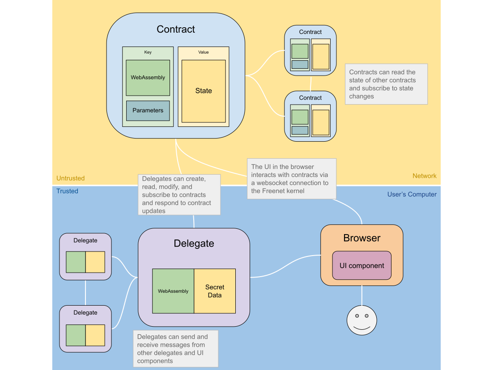
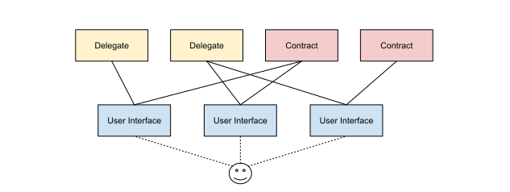

# Anatomy of a Decentralized Application

Delegates, contracts, and user interfaces (UIs) each serve distinct roles in the
Freenet ecosystem. Contracts control public data, or "shared state". Delegates
act as the user's agent and can store private data on the user's behalf, while
UIs provide an interface between these and the user through a web browser.

## Freenet Kernel

The kernel is the core of Freenet, it's the software that runs on the user's
computer. It's responsible for:

* Providing a user-friendly interface to access Freenet via a web browser
* Host the user's [delegates](#delegates) and the private data they store
* Host [contracts](#contracts) and their associated data on behalf of the network
* Manage communication between contracts, delegates, and UI componets

The kernel is written in Rust and is designed to be small (hopefully less than 5
MB), efficient, and able to run on a wide range of devices like smartphones, desktop
computers, and embedded devices.

## User Interface

On the normal web, a user might visit https://gmail.com/, their browser
will download the Gmail user interface which then runs in their browser and connects
back to the Gmail servers. 

On Freenet the user interface is downloaded from a Freenet contract, and it
interacts with contracts and delegates through the Freenet kernel.

These UIs are built using web technologies such as HTML, CSS, and JavaScript,
and are distributed over Freenet and run in a web browser. UIs can create,
retrieve, and update contracts through a WebSocket connection to the local
Freenet peer, as well as communicate with delegates. 

Because UIs run in a web browser, they can be built using any web framework,
such as React, Angular, Vue.js, Bootstrap, and so on. 

## Contracts

Contracts in Freenet are [WebAssembly](https://webassembly.org) components that
manage and regulate public state. They can be likened to inodes in a filesystem,
tables in a database, or memory locations in a globally shared memory. Contracts
define the circumstances under which state can be modified and whether a given
state is allowed.

Contracts and their associated state reside on the Freenet network on peers
determined by the contract's location, which is derived from its WebAssembly
code and parameters. While a user's delegates are hosted on their local Freenet
peer, contracts are hosted on the network as a whole.

Contracts also outline how to merge two valid states, creating a new state that
incorporates both. This process ensures [eventual
consistency](https://en.wikipedia.org/wiki/Eventual_consistency) of the state in
Freenet, using an approach akin to
[CRDTs](https://en.wikipedia.org/wiki/Conflict-free_replicated_data_type).

Each contract is identified by a cryptographic hash, which is a combination of
its code and parameters, also referred to as its "key". This key is used to
identify the contract and to verify that the contract's code and parameters have
not been tampered with.

### Contract Use Cases

Take, for example, a public blog contract. The state of this contract would be
the blog's content, which consists of a list of blog posts. The code within the
contract dictates that new posts may only be added if they are signed by the
blog's owner, while the contract's parameters include the blog owner's public
key.

## Delegates

Delegates are WebAssembly code that act as user avatars on Freenet, they
must implement the [DelegateInterface](https://github.com/freenet/locutus/blob/b1e59528eaeba31c7f09881594d19347de60e8cd/crates/locutus-stdlib/src/delegate_interface.rs#L121).

Delegates run in the Freenet kernel and manage private data and interact with
other Freenet entities like contracts, apps, and other delegates on behalf of
the user. They can store and control private data like cryptographic keys,
tokens, and passwords, and communicate with users, for example to ask permission
to sign some data. They can be created by UI components or other delegates.

Unlike contracts, which require network verification, delegates run on the
user's computer and are trusted to execute code without verification. Delegates'
state is private, while contracts' state is public but may be encrypted.

Delegates are used for:
- Managing private data similar to a browser's [web
  storage](https://en.wikipedia.org/wiki/Web_storage)
  - eg. private keys, tokens
- Acting on the user's behalf on Freenet
  - eg. consuming received messages in an inbox
- Storing user data
  - e.g., contacts, messages

### Origin Attestation

Delegates communicate with apps and other delegates using messages, a crucial
aspect of which is the delegate's ability to identify the origin of a message.
The origin is identified by the key associated with the app, contract, or other
delegate that sent the message. This key is generated cryptographically based on
the code and configuration parameters of the sender, enabling delegates to
verify the behavior of other delegates or apps with which they interact.

This allows for highly flexible composability, as components can trust the
behavior of the components they communicate with by verifying their code and
configuration parameters.

### Delegate Use Cases

* A key manager delegate is responsible for managing a user's private keys,
  other components can request that the key manager delegate sign messages
  or other data on their behalf.

* An inbox delegate is responsible for maintaining an inbox of messages sent to
  the user in a messaging system. It pulls messages from an inbox contract,
  decrypts them, and stores them locally where they can be queried by other
  components.
