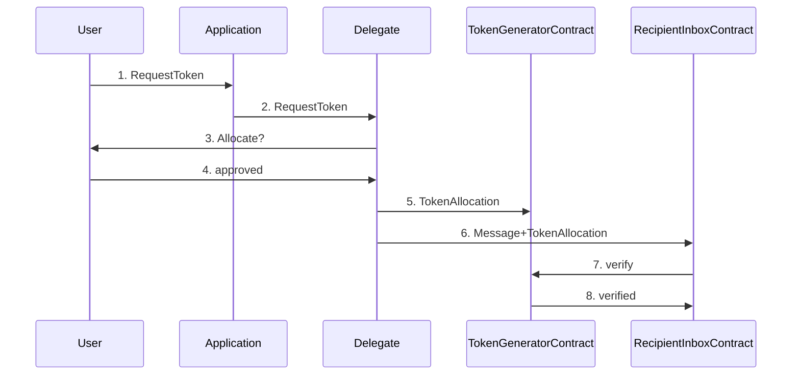

# Example: Antiflood Token System

## Purpose

The Antiflood Token System (AFT) is a decentralized system aimed to provide a
simple, but general purpose solution to flooding, denial-of-service attacks,
and spam.

AFT allows users to generate tokens through a "token generator", which is
created by completing a "hard" task, such as making a donation to Freenet.
Tokens are generated at a fixed rate and can be utilized to perform activities,
such as sending messages.

The recipient can specify the required token "tier," with each tier being
generated at different intervals (e.g. 1 minute, 1 hour). This way, if a
recipient experiences a high volume of messages, they can increase the token
tier to make it more challenging to generate, thus reducing the flood.

## AFT Delegate

The AFT relies on a
[TokenDelegate](https://github.com/freenet/freenet-core/blob/f1c8075e173f171c17ffa8d08803b2c9aea4ddf3/modules/antiflood-tokens/components/token-generator/src/lib.rs#L17)
that implements this DelegateInterface.

#### Token Generator

The
[TokenAllocContract](https://github.com/freenet/freenet-core/blob/f1c8075e173f171c17ffa8d08803b2c9aea4ddf3/modules/antiflood-tokens/contracts/token-allocation-record/src/lib.rs#L10)
keeps track of token assignments to ensure that tokens are not double spent.
New tokens are generated at a fixed rate that depends on the tier required by
the recipient.

#### Recepient Inbox

The recipient inbox contract keeps track of inbound messages sent to a
recipient, verifying that each is accompanied by a valid token of the required
tier.

## Sequence Diagram

1. User requests a token from the application, perhaps by composing a message
   and clicking "send" in the UI

2. The application requests a token from the delegate via its websocket
   connection to the Freenet node

3. The delegate requests permission from the user to allocate a token, this
   occurs independently of the application, perhaps via an OS-specific
   notification mechanism

4. The user approves the allocation

5. The delegate allocates a token to the token generator contract

6. The delegate sends the message and token allocation to the recipient inbox
   contract

7. The recipient inbox contract verifies that the token allocation is valid
   before appending the inbound message to its state

8. The token generator contract verifies that the token allocation is valid and
   adds it to its list of allocations
