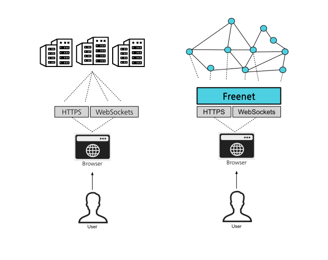

# Introduction

Freenet is a distributed, decentralized alternative to the centralized World
Wide Web, designed to unleash a new era of innovation and competition, while
protecting freedom of speech and privacy. 

The heart of Freenet is the [Core](https://github.com/freenet/freenet-core), 
which runs on users' computer, smartphone, or other devices. The Core is 
tiny, less than 5 MB, allowing it to be installed in a matter of seconds and 
is compatible with a wide range of hardware.

Freenet is a [peer-to-peer network](architecture/p2p-network.md), which means
that computers that are part of the network self-organize into a global network
without any central authority, and the work of hosting services is distributed
among the users.
