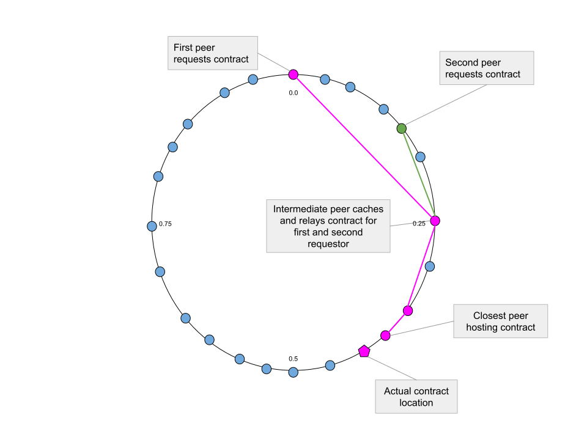

# Freenet Network Topology

## Small-World Network

Freenet operates as a decentralized peer-to-peer network based on the principles
of a [small-world network](https://en.wikipedia.org/wiki/Small-world_network).
This network topology allows Freenet to be resilient against denial-of-service
attacks, automatically scale to accommodate demand, and provide observable data
stores. Users can subscribe to specific keys to receive notifications of updates
as they occur.

## Understanding Freenet Peers

A Freenet peer refers to a computer that runs the Freenet kernel software and
participates in the network. The organization of peers follows a ring structure,
where each position on the ring represents a numerical value ranging from 0.0 to
1.0. This value signifies the peer's location within the network.

## Establishing Neighbor Connections

Each Freenet peer, or kernel, establishes bi-directional connections with a
group of other peers known as its "neighbors." These connections rely on the
User Datagram Protocol (UDP) and may involve techniques to traverse firewalls
when required.

To optimize resource utilization, peers monitor the resources they use while
responding to neighbor requests, including bandwidth, memory, CPU usage, and
storage. Peers also track the services offered by their neighbors, measured by
the number of requests directed to those neighbors.

To ensure network efficiency, a peer may sever its connection with a neighbor
that consumes excessive resources relative to the number of requests it
receives.

## Implementing Adaptive Routing for Efficient Data Retrieval

When a peer intends to read, create, or modify a contract, it sends a request to
the peers hosting the contract. The request is directed to the neighbor most
likely to retrieve the contract quickly. Ideally, this neighbor is the one
closest to the contract's location, a concept known as "greedy routing."
However, other factors, such as connection speed, may influence the selection.

Freenet addresses this challenge by monitoring the past performance of peers and
selecting the one most likely to respond quickly and successfully. This
selection considers both past performance and proximity to the desired contract.
The process, known as adaptive routing, employs an algorithm called [isotonic
regression](https://github.com/sanity/pav.rs).
