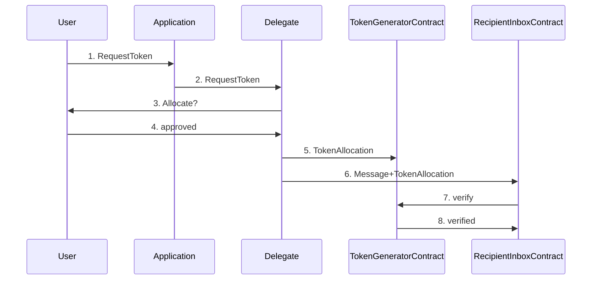

# The Primitives of Decentralized Software on Freenet

To illustrate the primitives of decentralized software, we will use the Antiflood Token System (AFT) as an example.

The AFT is a decentralized system aimed at combating flooding, denial-of-service attacks, and spam. AFT operates by
allowing users to generate tokens through a "token generator" by completing a "hard" task, such as making a donation to
Freenet. Tokens are generated at a fixed rate and can be utilized to perform activities, such as sending messages.

The recipient can specify the required token "tier," with each tier being generated at different intervals (e.g. 1
minute, 1 hour). This way, if a recipient experiences a high volume of messages, they can increase the token tier to
make it more challenging to generate, thus reducing the flood.

## Primitives

### Applications

This is the user interface that wishes to use the AFT system to send a message, for example a decentralized instant
messaging system. Applications will typically run in a web browser and either implemented in JavaScript or WebAssembly.

### Delegates

Delegates are software that act as intermediaries between the user and various digital entities such as contracts,
apps, and other delegates. They perform tasks, store secrets, perform cryptographic operations, and communicate with
the user for permission to perform specific actions. Delegates are webassembly code implementing the
[DelegateInterface](https://github.com/freenet/locutus/blob/f1c8075e173f171c17ffa8d08803b2c9aea4ddf3/crates/locutus-stdlib/src/component_interface.rs#L121).

The AFT relies on a [TokenDelegate](https://github.com/freenet/locutus/blob/f1c8075e173f171c17ffa8d08803b2c9aea4ddf3/modules/antiflood-tokens/components/token-generator/src/lib.rs#L17) that implements this DelegateInterface.

### Contracts

Contracts are webassembly code implementing the 
[ContractInterface](https://github.com/freenet/locutus/blob/f1c8075e173f171c17ffa8d08803b2c9aea4ddf3/modules/antiflood-tokens/contracts/token-allocation-record/src/lib.rs#L10). 

#### Token Generator

The
[TokenAllocContract](https://github.com/freenet/locutus/blob/f1c8075e173f171c17ffa8d08803b2c9aea4ddf3/modules/antiflood-tokens/contracts/token-allocation-record/src/lib.rs#L10)
keeps track of token assignments to ensure that tokens are not double spent. New tokens are generated at a fixed rate
that depends on the tier required by the recipient.

#### Recepient Inbox

The recipient inbox contract keeps track of inbound messages sent to a recipient, verifying that each is accompanied
by a valid token of the required tier.

## Sequence Diagram

1. User requests a token from the application, perhaps by composing a message and clicking "send" in the UI

2. The application requests a token from the delegate via its websocket connection to the Freenet node

3. The delegate requests permission from the user to allocate a token, this occurs independently of the
   application, perhaps via an OS-specific notification mechanism

4. The user approves the allocation

5. The delegate allocates a token to the token generator contract

6. The delegate sends the message and token allocation to the recipient inbox contract

7. The recipient inbox contract verifies that the token allocation is valid before appending the inbound 
  message to its state

8. The token generator contract verifies that the token allocation is valid and adds it to its list of
   allocations